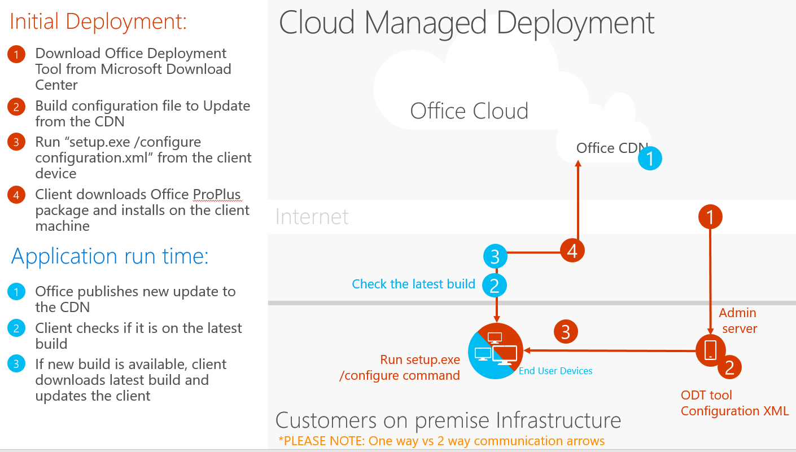

# Best practices: Recommended deployment scenarios

 *The Best Practices Guide includes deployment recommendations and real-world examples from the Office 365 Product Group and delivery experts from Microsoft Services. For a list of all the articles, see [Best practices](best-practices.md).* 
  
The following are example customers that are an amalgam of the most common customer scenarios that we encounter. If the example customer does not match your environment exactly, that is okay because between all three of the customer examples, we should cover most of the of the situations any customer could face.
  
We have named these customer scenarios Enterprise Managed, Locally Managed, and Cloud Managed, based on the primary distribution and update management solution that each scenario leverages.
  
## Call to action

Please review the three scenarios and decide which one best fits your current environment. Lead with this scenario and feel free to add portions from the other two scenarios. For example, your environment might be very similar to the  *Enterprise Managed*  scenario, except that you leverage an older MSI version of Project/Visio and allow Mac users to configure their own software. You would follow all of the guidance from *Enterprise Managed*  except when it comes to Project/Visio and Mac clients, and then check *Locally Managed*  and *Cloud Managed*  to see which scenario best fits your Project/Visio and Mac client usage. We recommend that you identifywhich scenario is most similar to your current environment and then mix and match components from the other scenarios to build out a complete assessment and deployment plan.
  
## The Enterprise Managed scenario

 *Enterprise Managed*  represents large to very large organizations, . in which the work force is leveraging nearly every single technology that exists, ranging from desktops to notebooks to tablets, software distribution tools, and virtual environments like Remote Desktop Services and Virtual Desktop Infrastructure. The IT department manages the client software using software management tools such as System Center Configuration Manager, and has dedicated teams that administer the company's Active Directory components such as Active Directory Domain Services (AD DS), Active Directory Federation Services (AD FS), Group Policy, etc.
  

  
If this scenario represents your organization, see [Best practices: Enterprise managed scenario](best-practices-enterprise-managed-scenario.md).
  
## The Locally Managed scenario

 *Locally Managed*  represents medium to large organizations that may have offices in multiple countries, but are not considered to be globally distributed. Employees are generally located out of a centralized office in the country, with limited small offices. The work force is primarily leveraging newer productivity software, including some VDI, but the IT department does not have software distribution tools to manage client software. IT Administrators leverage a Distributed File System (DFS) and network shares to host installation packages that end users install, and utilize custom scripts and batch files for automated deployments for end users because the users do not have local admin rights. They do not have dedicated IT teams to specific products, and instead leverages shared teams that manage multiple technologies of the IT environment such as Active Directory Domain Services (AD DS), Active Directory Federation Services (AD FS), Group Policy, etc.
  

  
If this scenario represents your organization, see [Best practices: Locally managed scenario](best-practices-locally-managed-scenario.md).
  
## The Cloud Managed scenario

 *Cloud Managed*  represents generally small businesses who are generally located out of a small centralized office in a single country; however, they might have smaller remote offices throughout the country. The work force leverages the newest productivity devices and software on the market, because having a smaller organization allows for more rapid adoption of new technology. They have a small IT team that manages the entire organizational IT environment technologies such as Active Directory Domain Services (AD DS), Azure Active Directory Password Sync, GPO, etc. The IT team does not use software distribution tools to manage client software, and no Distributed File System (DFS) exists. Network shares are leveraged for installing software, and users have administrative privileges on their client devices. The IT team provides batch files or scripts for end users to automate deployments.
  

  
If this scenario represents your organization, see [Best practices: Cloud managed scenario](best-practices-cloud-managed-scenario.md).
  

