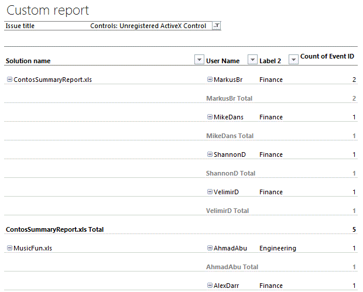
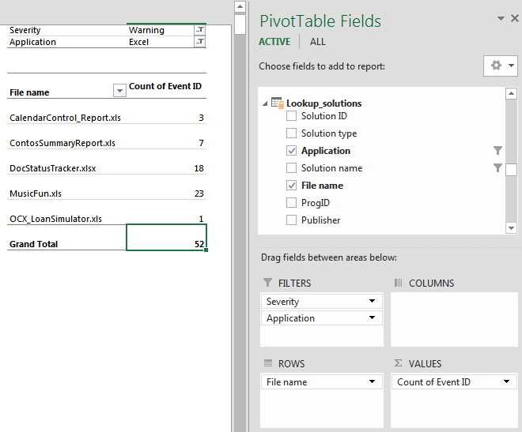
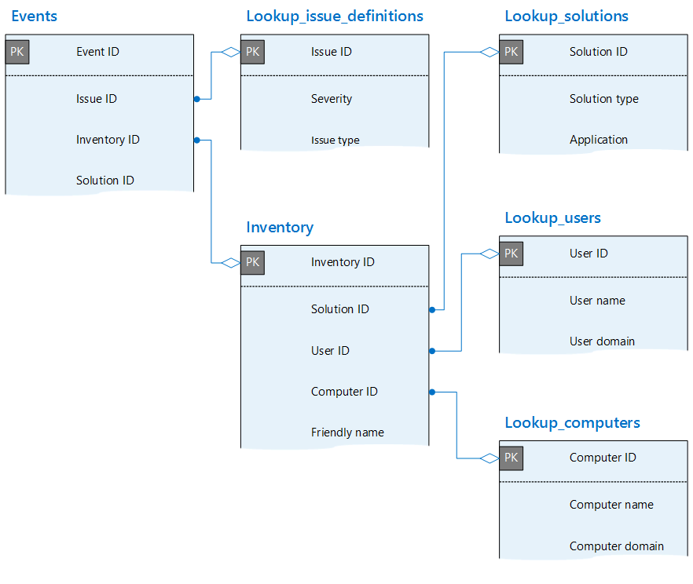
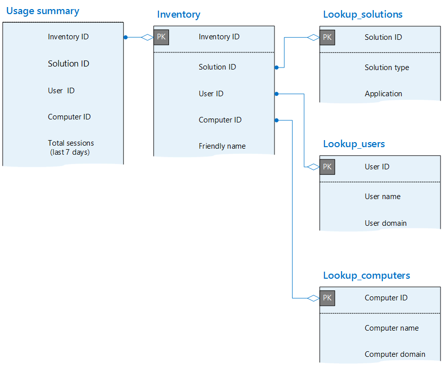
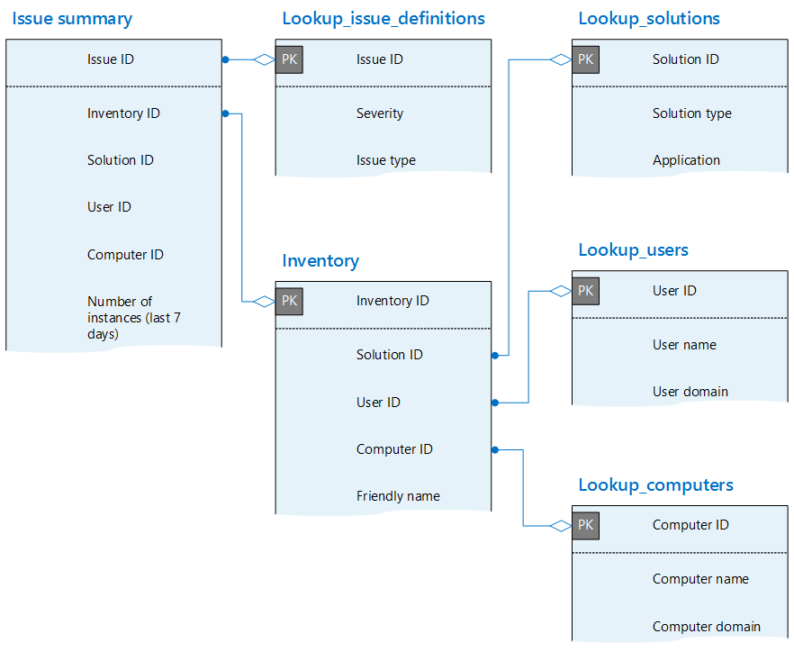

# Custom reporting and database schema reference for Telemetry Dashboard

***Applies to:*** *Office 365 ProPlus, Office 2019, and Office 2016*

> [!NOTE]
> To assess your Office compatibility, we recommend using the [Readiness Toolkit for Office add-ins and VBA](https://www.microsoft.com/en-us/download/details.aspx?id=55983). The Readiness Toolkit is a free download and can be used to identify the VBA macros and add-ins used in your organization. Also, the Excel-based readiness reports can tell you which add-ins are adopted or supported in Office 365 ProPlus and can provide suggestions on how to remediate VBA macros issues that are identified. For more information, see [Use the Readiness Toolkit to assess application compatibility for Office 365 ProPlus](../use-the-readiness-toolkit-to-assess-application-compatibility-for-office-365-pro.md).

  
  
The built-in worksheets in Telemetry Dashboard display lots of useful data, but sometimes you want more control over how the data is displayed. To do this, you can use the custom reporting feature in Telemetry Dashboard. This feature uses PivotTable reports to help give you a deeper view into how Office is being used in your organization. In this article, you can learn how to create custom reports, and you can find information about the telemetry database tables and fields that are used in custom reports.
  
    

## Overview of custom reports in Telemetry Dashboard

The built-in worksheets in Telemetry Dashboard show you a relevant subset of the data that is collected by Telemetry Agents. However, the built-in worksheets aren't customizable, and you might want to see a combined view of data that appears on different worksheets. This is where custom reporting can help you use PivotTable reports to view telemetry data in meaningful ways. 
  
For example, the following screen shot shows a custom report that lists the unregistered ActiveX controls that are detected on monitored clients. You can see that we've added fields to display the solution name, user name, and business group (as configured for Label 2 when the agents were deployed). This report helps us identify the solutions that use unregistered ActiveX controls and who is using them. In contrast, the **Documents** worksheet lists these solutions but doesn't have a column to indicate whether unregistered ActiveX controls are detected. You have to view the **Document sessions** worksheet for each document to see whether ActiveX controls are being used. 
  
**Custom report that shows unregistered ActiveX solutions**

  
> [!IMPORTANT]
> To use labels in custom reports, you have to configure them when you deploy Telemetry Agents. If you haven't already done this, we recommend that you carefully plan labels that support the types of custom reporting that you'll do. For example, setting labels to identify business groups, locations, and job roles can help you find trends and issues for specific groups or types of users. [Enabling and configuring the telemetry agent](deploy-telemetry-dashboard.md#configure) will help you configure labels (known as **tags** in the Group Policy settings and registry settings for Telemetry Agent). 
  
As another example, the following screen shot shows the list of Office client computers as displayed in the **Deployments** worksheet. This shows a high-level summary of Office deployments. But it doesn't give you a breakdown of how Office is deployed across business groups. 
  
**The Deployments worksheet**

  
You can get a more detailed view of Office clients by using a custom report. In the following illustration, the Office clients are grouped by business groups (as configured for Label 2) so that you can see the breakdown of Office deployments across each group. You can also create a PivotChart to help show the data. This custom report uses a hidden table, System_details, that you have to manually add before you can add Office versions to your report. You can learn how to do this in [Hidden tables in Telemetry Dashboard custom reports](custom-reporting-and-database-schema-reference-for-telemetry-dashboard.md#hidden_tables).
  
**Custom report showing Office deployments by business group**

  

## Create custom reports in Telemetry Dashboard

You can create a single custom report on the **Custom report** worksheet. This automatically loads the default tables and creates a basic custom report that you can use as a starting point. Then, you can add and remove fields to design a report that meets your business needs. For performance reasons, not all tables are loaded automatically when you create a custom report. You can add tables by using the procedure in [Hidden tables in Telemetry Dashboard custom reports](custom-reporting-and-database-schema-reference-for-telemetry-dashboard.md#hidden_tables). The most common reason to add hidden tables is to gain access to Office builds, which are available in the **System_details** table. 
  
In this video demo, you can see custom reporting in action. We compare data that is shown in the **Solutions** worksheet to similar data that is shown in a custom report. This video will also help you learn how to add and move fields in a PivotTable report. 
  
**Custom reporting in Telemetry Dashboard**

> [!VIDEO https://www.microsoft.com/videoplayer/embed/ed8327e4-c063-40f5-a634-230c067d73b4?autoplay=false]
  
If you use large data sets in your custom reports, you might encounter the [2-GB memory limitation](https://go.microsoft.com/fwlink/p/?LinkID=330482) when you use the 32-bit version of Excel. There are a couple ways that you can work around this limitation: 
  
- Use the 64-bit version of Excel, which doesn't have the 2-GB memory limitation, but does have other drawbacks. See [Choose between the 64-bit or 32-bit version of Office](https://go.microsoft.com/fwlink/p/?LinkId=250955) to learn more. 
    
- Adjust the reporting threshold in the telemetry database to change how much data is pulled into PowerPivot when custom reports are created, You can learn more about this setting in [How to configure privacy and performance settings in Telemetry Dashboard](manage-the-privacy-of-data-monitored-by-telemetry-in-office.md#Configure).
    
To create a custom report, you have to first start Telemetry Dashboard. The following table describes how to start the dashboard in different versions of Windows.
  
**To start Telemetry Dashboard**

|**If you have this operating system**|**Follow these steps to start Telemetry Dashboard**|
|:-----|:-----|
|Windows 10, Windows 7, Windows Server 2008, or Windows Server 2008 R2    |From the **Start** menu, choose **All Programs**, then **Microsoft Office 2016 Tools**, then **Telemetry Dashboard for Office 2016**.    |
|Windows 8 or Windows 8.1    |On the **Start** screen, type **Telemetry Dashboard**, and then choose it from the search results.    |
|Windows Server 2012 or Windows Server 2012 R2    |Swipe in from the right edge to show the charm bar, and then choose **Search** to see all the apps that are installed on the computer. Next, choose **Telemetry Dashboard for Office 2016**.    |

For Office 365 ProPlus and Office 2019, look for **Telemetery Dashboard for Office** under **Microsoft Office Tools**.
   
### To create a custom report

1. In Telemetry Dashboard, on the **Getting Started** worksheet, choose **Connect to Database**.
    
2. In the **Data connection settings** dialog box, type the names of the computer running SQL Server and the SQL database that you specified when you installed Telemetry Processor. 
    
3. In the navigation pane, choose **Custom report**.
    
4. On the **Custom report** worksheet, choose **Create custom report**.
    
To help you get started, the following tables provide procedures for creating different kinds of custom reports.
  
**Sample custom reports in Telemetry Dashboard**

To create a custom report that shows solution stability, do the following:
1. From the Lookup_solutions table, drag Solution name to the FILTERS well. 
2. After the Solution name field is added to the custom report, use the filter button (next to the Solution name) to choose the solution. 
3. From the Inventory table, drag Solution version to the ROWS well. 

To create a custom report that shows Excel warnings, do the following: 
1. From the Lookup_issue_definitions table, drag Severity to the FILTERS well. 
2. After the Severity field is added to the custom report, use the filter button (next to Severity) to choose Warning. 
3. From the Lookup_solutions table, drag Application to the FILTERS well, and then adjust the filter to select Excel. 
4. From the Lookup_solutions table, drag File name to the ROWS well.

   

## Default tables and fields in Telemetry Dashboard custom reports

The following tables describe the six tables and their related fields that are shown by default in the **PivotTable Fields** list when you create custom reports. 
  
**Default tables**

|**Table name**|**Description**|
|:-----|:-----|
|Events    |Contains issue events for the past three months.    |
|Inventory    |Contains unique instance data, such as load time and solution version, about the Office documents and solutions that are monitored.    |
|Lookup_computers    |Contains information about the computers that are monitored. This includes computer name, domain, hardware information, and Windows version.    |
|Lookup_issue_definitions    |Contains information about the issues that were detected, such as issue type, issue title, severity, and explanation.    |
|Lookup_solutions    |Contains information about solutions that were detected, such as solution type, name, and publisher.    |
|Lookup_users    |Contains information about the users who use monitored client computers, such as their user name, domain, and label settings.    |
   
The following table lists the fields in the **Events** table. 
  
**Fields in the Events table**

|**Field name**|**Type**|**Description**|
|:-----|:-----|:-----|
|Event ID    |Number    |The primary key for this table.    |
|Issue ID    |Number    | Connects to the **Lookup_issue_definitions** table.      You can view these definitions in the following articles:     - [Compatibility issues in Office](https://go.microsoft.com/fwlink/p/?LinkId=625981)   - [Troubleshooting Office files and custom solutions with the telemetry log](https://go.microsoft.com/fwlink/p/?LinkId=625982) (see Table 2)    |
|Inventory ID    |String    |Connects to the **Inventory** table.    |
|Solution ID    |Number    |Connects to the **Lookup_solutions** table.    |
|User ID    |Number    |Connects to the **Lookup_users** table.    |
|Computer ID    |Number    |Connects to the **Lookup_computers** table.    |
|Event date    |Date/time    |Shows the date and time of the event.    |
|Application version (detail)    |String    |Shows the version of the Office application that triggered the event.    |
   
The following table lists the fields in the **Inventory** table. 
  
**Fields in the Inventory table**

|**Field name**|**Type**|**Description**|
|:-----|:-----|:-----|
|Inventory ID    |Strings    |The primary key for this table.    |
|Solution ID    |Numbers    |Connects to the **Lookup_solutions** table.    |
|User ID    |Numbers    |Connects to the **Lookup_users** table.    |
|Computer ID    |Numbers    |Connects to the **Lookup_computers** table.    |
|Friendly name    |Strings    |Shows the friendly name of the solution.    |
|Location    |Strings    |Shows the file location of the file.    |
|Load time (seconds)    |Numbers    |Shows the load time of the solution in seconds.    |
|Title    |Strings    |Shows the title of the document.    |
|Author    |Strings    |Shows the author of the document.    |
|CPU architecture    |Strings    |Shows the CPU architecture.    |
|Solution version    |Strings    |Shows the solution version.    |
|Load behavior    |Numbers    |Shows the load behavior of the COM add-ins as follows:     **0** - Do not load automatically (Unloaded)    **1** - Do not load automatically (Loaded)    **2** - Load at startup (Unloaded)    **3** - Load at startup (Loaded)    **8** - Load on demand (Unloaded)    **9** - Load on demand (Loaded)    **16** - Load first time, and then load on demand (Loaded)    |
|File size (bytes)    |Numbers    |Shows the file size in bytes.    |
|Has VBA    |Boolean    |Shows 1 if the document has VBA.    |
|Has OLE    |Boolean    |Shows 1 if the document has OLE objects.    |
|Has external data connection    |Boolean    |Shows 1 if the document has an external data connection.    |
|Has ActiveX control    |Boolean    |Shows 1 if the document has an ActiveX control.    |
|Has assembly reference    |Boolean    |Shows 1 if the document has an assembly reference.    |
|Has XML schema    |Boolean    |Shows 1 if the document has an XML schema.    |
|Has XML expansion pack    |Boolean    |Shows 1 if the document has an XML expansion pack.    |
|Last loaded    |Date/time    |Shows the last date and time that the solution was loaded.    |
|Last scanned    |Date/time    |Shows the last date and time that the computer was scanned by the agent.    |
   
The following table shows the fields in the **Lookup_computers** table. 
  
**Fields in the Lookup_computers table**

|**Field name**|**Type**|**Description**|
|:-----|:-----|:-----|
|Computer ID    |Number    |The primary key for this table.    |
|Computer name    |String    |Shows the computer name.    |
|Computer domain    |String    |Shows the domain name that is registered for this computer.    |
|Telemetry Agent version    |String    |Shows the Telemetry Agent version that uploads the data to the telemetry database.    |
|Computer processor name    |String    |Shows the processor name of the computer.    |
|Number of processors (logical)    |Number    |Shows the number of logical processors in the computer.    |
|Number of processors (physical)    |Number    |Shows the number of physical processors in the computer.    |
|System type    |String    |Shows the architecture type (32-bit or 64-bit) of the computer.    |
|Computer installed memory    |Number    |Shows amount of memory (in megabytes) that is installed in this computer.    |
|Display resolution    |String    |Shows this computer's screen resolution (for example, 1280 x 780).    |
|Display resolution (width)    |Number    |Shows the screen resolution width.    |
|Display resolution (height)    |Number    |Shows the screen resolution height.    |
|Windows version    |String    |Shows the Windows version of the computer.    |
|Windows version (detail)    |String    |Shows Windows version in detail.    |
|Windows system locale    |String    |Shows the system locale setting for Windows.    |
|Windows system display language    |String    |Shows system display language for Windows.    |
|IE version    |String    |Shows the Internet Explorer version.    |
|IE version (detail)    |String    |Shows the Internet Explorer version in detail.    |
   
The following table shows the fields in the **Lookup_solutions** table. 
  
**Fields in the Lookup_solutions table**

|**Field name**|**Type**|**Description**|
|:-----|:-----|:-----|
|Solution ID    |Number    |The primary key for this table.    |
|Solution type    |String    |Shows the solution or document type.    |
|Application    |String    |Shows the application that used this solution or document.    |
|Solution name    |String    |Shows the solution name.    |
|File name    |String    |Shows the solution or document file name.    |
|ProgID    |String    |Shows the solution ProgID.    |
|Publisher    |String    |Shows the solution or document publisher name.    |
   
The following table shows the fields in the **Lookup_users** table. 
  
**Fields in the Lookup_users table**

|**Field name**|**Type**|**Description**|
|:-----|:-----|:-----|
|User ID    |Number    |The primary key for this table.    |
|User name    |String    |Shows the user name.    |
|User domain    |String    |Shows the domain name for this user.    |
|Label 1    |String    |Shows the Label 1 setting.    |
|Label 2    |String    |Shows the Label 2 setting.    |
|Label 3    |String    |Shows the Label 3 setting.    |
|Label 4    |String    |Shows the Label 4 setting.    |
   
The following table shows the fields in the **Lookup_issue_definitions** table. 
  
**Fields in the Lookup_issue_definitions table**

|**Field name**|**Type**|**Description**|
|:-----|:-----|:-----|
|Issue ID    |Number    |The primary key for this table.    |
|Severity    |String    |Shows the severity of issue.    |
|Issue type    |String    |Shows the issue type.    |
|Issue title    |String    |Shows the issue title.    |
|Explanation    |String    |Shows the issue explanation.    |
|More info    |String    |Shows the URL where you can get more information.    |
   

## Hidden tables in Telemetry Dashboard custom reports

Not all tables are loaded when you create a custom report. If you want to access additional data for your custom report, you can load the **Usage_summary**, **Issue_summary**, and **System_details** tables. Follow these steps to add these hidden tables to Telemetry Dashboard. 
  
### To add hidden tables to Telemetry Dashboard

1. Follow the steps in [Create custom reports in Telemetry Dashboard](custom-reporting-and-database-schema-reference-for-telemetry-dashboard.md#Create_customreport) to start Telemetry Dashboard, connect to the database, and create a custom report. 
    
2. After you create the custom report, select any area in the custom report. This makes the **ANALYZE** tab available on the ribbon. 
    
3. On the **ANALYZE** tab (under **PIVOTTABLE TOOLS**) on the ribbon, in the **Data** group, select **Change Data Source**, and then select **Connection Properties**.
    
4. In the **Workbook Connections for Custom report** dialog box, select **Telemetry Dashboard - Custom report**, select **Properties**, and then select the **Definition** tab. 
    
5. In the **Command text** box, add the following additional text (do not delete or overwrite the existing text): ,"Usage_summary", "Issue_summary", "System_details"
    
6. Choose **OK**, and on each dialog box, select **Close**.
    
7. In the **PivotTable Fields** list, Choose **ALL**, and then scroll down to see the newly added tables for **Usage_summary**, **Issue_summary**, and **System_details**. 
    
8. Right-click each new table, and choose **Show in Active Tab**. The new tables are added to the **Active** list under **PivotTable Fields** in the right column for easier access. 
    
The following tables list the hidden tables that you have to manually add to Telemetry Dashboard and describe the fields in the hidden tables.
  
**Hidden tables in Telemetry Dashboard custom reports**

|**Table name**|**Comments**|
|:-----|:-----|
|Usage_summary    | Shows Office telemetry data for seven days, one month, and three months. You can use this table to create a relationship to the following tables to see more details:     - **Inventory**   - **Lookup_computers**   - **Lookup_solutions**   - **Lookup_users**   |
|Issue_summary    | Shows the issues that have occurred in the last seven days, one month, and three months. You can use this table to create a relationship to following tables to see more details:     - **Inventory**   - **Lookup_computers**   - **Lookup_issue_definitions**   - **Lookup_solutions**   - **Lookup_users**   |
|System_details    |Shows user and computer information.    |
   
The following table describes the fields in the Usage_summary table.
  
**Fields in the Usage_summary table**

|**Field name**|**Type**|**Description**|
|:-----|:-----|:-----|
|Inventory ID    |String    |Connects to the **Inventory** table to gain access to more details in the PivotTable report.    |
|Solution ID    |Number    |Connects to the **Lookup_solutions** table to obtain more details in PivotTable report if there is no relationship between the **Inventory** and **Lookup_solutions** tables.    |
|User ID    |Number    |Connects to the **Lookup_users** table to obtain more details in the PivotTable report if there is no relationship between the **Inventory** and **Lookup_users** tables.    |
|Computer ID    |Number    |Connects to the **Lookup_computers** table to obtain more details in PivotTable report if there is no relationship between the **Inventory** and **Lookup_computers** tables.    |
|Total session (last 7 days)    |Number    |Shows the total number of sessions in the last seven days.    |
|Total session (last 1 month)    |Number    |Shows the total number of sessions in the last one month.    |
|Total session (last 3 months)    |Number    |Shows the total number of sessions in the last three months.    |
|Failed session (last 7 days)    |Number    |Shows the total number of sessions that had an issue in last the seven days.    |
|Failed session (last 1 month)    |Number    |Shows the total number of sessions that had an issue in the last one month.    |
|Failed session (last 3 months)    |Number    |Shows the total number of sessions that had an issue in the last three months.    |
   
The following table describes the fields in the Issue_summary table.
  
**Fields in the Issue_summary table**

|**Field name**|**Type**|**Description**|
|:-----|:-----|:-----|
|Issue ID    |Number    |Connects to the **Lookup_issue_definitions** table to obtain more details in the PivotTable report.    |
|Inventory ID    |String    |Connects to the **Inventory** table to obtain more details in the PivotTable report.    |
|Solution ID    |Number    |Connects to the **Lookup_solutions** table to obtain more details in the PivotTable report if there is no relationship between the **Inventory** and **Lookup_solutions** tables.    |
|User ID    |Number    |Connects to the **Lookup_users** table to obtain more details in the PivotTable report if there is no relationship between the **Inventory** and **Lookup_users** tables.    |
|Computer ID    |Number    |Connects to the **Lookup_computers** table to obtain more details in the PivotTable report if there is no relationship between the **Inventory** and **Lookup_computers** tables.    |
|Number of instances (last 7 days)    |Number    |Shows the number of issue events in the last seven days.    |
|Number of instances (last 1 month)    |Number    |Shows the number of issue events in the last one month.    |
|Number of instances (last 3 months)    |Number    |Shows the number of issue events in the last three months.    |
   
The following table describes the fields in the System_details table.
  
**Fields in the System_details table**

|**Field name**|**Type**|**Description**|
|:-----|:-----|:-----|
|Computer name    |String    |Shows the computer name.    |
|Computer domain    |String    |Shows the domain name that is registered for this computer.    |
|User name    |String    |Shows the user name.    |
|User domain    |String    |Shows the domain name for this user.    |
|Label 1    |String    |Shows the Label 1 setting.    |
|Label 2    |String    |Shows the Label 2 setting.    |
|Label 3    |String    |Shows the Label 3 setting.    |
|Label 4    |String    |Shows the Label 4 setting.    |
|Telemetry Agent version    |String    |Shows the version of Telemetry Agent that collected this data.    |
|Telemetry Processor (file share)    |String    |Shows the file share for the Telemetry Processor that uploaded data to the telemetry database.    |
|Telemetry Processor (computer)    |String    |Shows the computer name for the Telemetry Processor that uploaded data to the telemetry database.    |
|Computer processor name    |String    |Shows the processor name of the computer.    |
|Number of processors (logical)    |Number    |Shows the number of logical processors in the computer.    |
|Number of processors (physical)    |Number    |Shows the number of physical processors in the computer.    |
|System type    |String    |Shows the system type of the computer.    |
|Computer installed memory    |Number    |Shows amount of memory (in megabytes) that is installed in this computer.    |
|Display resolution    |String    |Shows this computer's screen resolution (for example, 1280 x 780).    |
|Display resolution (width)    |Number    |Shows the screen resolution width.    |
|Display resolution (height)    |Number    |Shows the screen resolution height.    |
|Windows version    |String    |Shows the Windows version of the computer.    |
|Windows version (detail)    |String    |Shows Windows version details.    |
|Windows system locale    |String    |Shows the system locale setting for Windows.    |
|Windows system display language    |String    |Shows the system display language setting for Windows.    |
|IE version    |String    |Shows the Internet Explorer version.    |
|IE version (details)    |String    |Shows the Internet Explorer version in detail.    |
|Windows system local (user)    |String    |Shows the Windows system local setting (user setting).    |
|Windows display language (user)    |String    |Shows the Windows system display language (user setting).    |
|Last scanned    |Date/time    |Shows the Telemetry Agent scanned date/time.    |
|Office 2003    |String    |Shows Office 2003 version details, if it is installed.    |
|Office 2007    |String    |Shows Office 2007 version details, if it is installed.    |
|Office 2010    |String    |Shows Office 2010 version details, if it is installed.    |
|Office 15    |String    |Shows Office 2013 version details, if it is installed.    |
|Office 16    |String    |Shows Office 2019 or Office 2016 version details, if it is installed.    |
   

## Default data relationships in Telemetry Dashboard custom reports

The following illustrations show the relationships between tables in the telemetry database. 
  
**Default relationships between tables in the telemetry database**

  
**The Usage_summary table and its relationships**

  
**The Issue_summary table and its relationships**

  
## Related topics

- [Compatibility and telemetry in Office](compatibility-and-telemetry-in-office.md)
- [Deploy Telemetry Dashboard](deploy-telemetry-dashboard.md)
- [Telemetry Dashboard worksheet reference](telemetry-dashboard-worksheet-reference.md)

