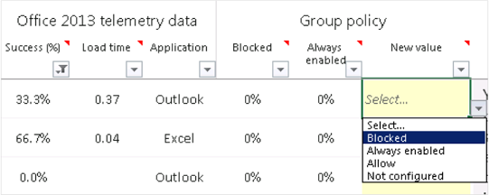

# Manage add-ins by using Telemetry Dashboard in Office

***Applies to:*** *Office 365 ProPlus, Office 2019, and Office 2016*

> [!NOTE]
> To assess your Office compatibility, we recommend using the [Readiness Toolkit for Office add-ins and VBA](https://www.microsoft.com/en-us/download/details.aspx?id=55983). The Readiness Toolkit is a free download and can be used to identify the VBA macros and add-ins used in your organization. Also, the Excel-based readiness reports can tell you which add-ins are adopted or supported in Office 365 ProPlus and can provide suggestions on how to remediate VBA macros issues that are identified. For more information, see [Use the Readiness Toolkit to assess application compatibility for Office 365 ProPlus](../use-the-readiness-toolkit-to-assess-application-compatibility-for-office-365-pro.md).

 **Summary:** Describes how to improve Office performance by managing add-ins by using Telemetry Dashboard. 
  
  
If you can prevent end users from running non-approved add-ins that might cause issues or slow performance, then you can reduce your support costs. If an add-in is crashing or takes a long time to load, you can disable the add-in for all Office client computers at the same time. Using Telemetry Dashboard, you can monitor add-in usage along with performance and other issues. With the collected data, you can decide which add-ins should be managed. This article points to more information about how to manage add-ins for Office by using Telemetry Dashboard.
  
  
## About add-in management with Telemetry Dashboard

Use the Add-in management worksheet to generate a Group Policy Object script that sets the configuration state of add-ins that are used with Office. The following screen shot displays the Add-in Management worksheet.
  
**User interface for managing add-ins in Telemetry Dashboard**

  
By using the Group Policy Administrative Templates, you can also create lists of managed add-ins and optionally block any add-in that isn't on the list. Users can't override these settings unless you allow them to.
  
For more information about how to manage Office add-ins by using Telemetry Dashboard, see [Let's manage add-ins using Telemetry Dashboard](https://go.microsoft.com/fwlink/p/?LinkId=271236).
  
## Related topics

- [Compatibility and telemetry in Office](compatibility-and-telemetry-in-office.md)
- [Deploy Telemetry Dashboard](deploy-telemetry-dashboard.md)
- [Manage the privacy of data monitored by telemetry in Office](manage-the-privacy-of-data-monitored-by-telemetry-in-office.md)

