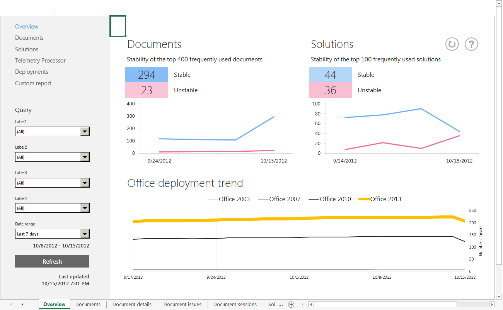
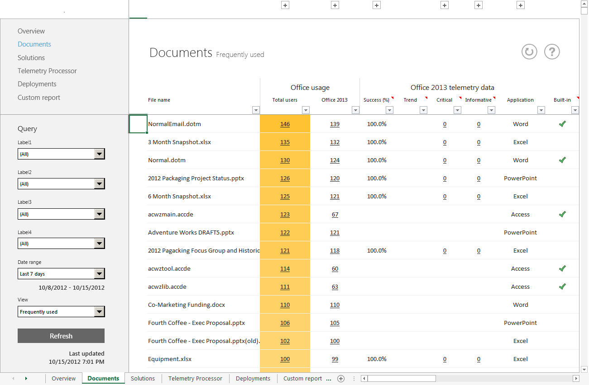
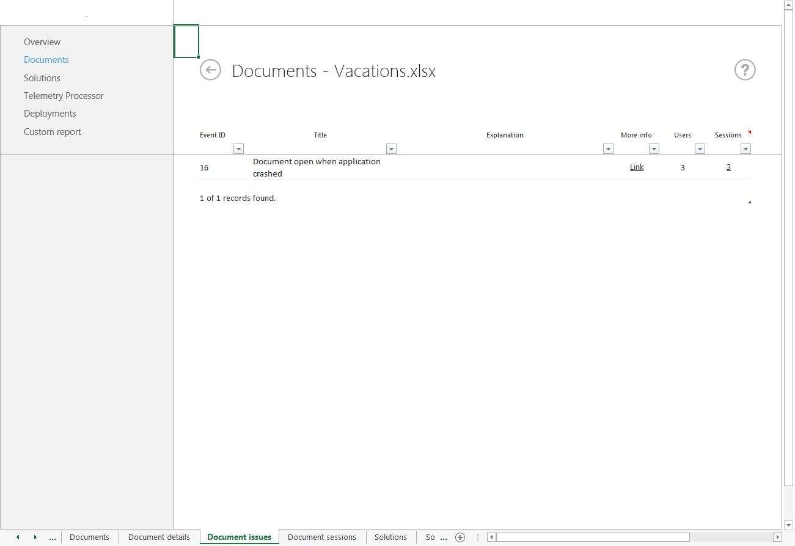
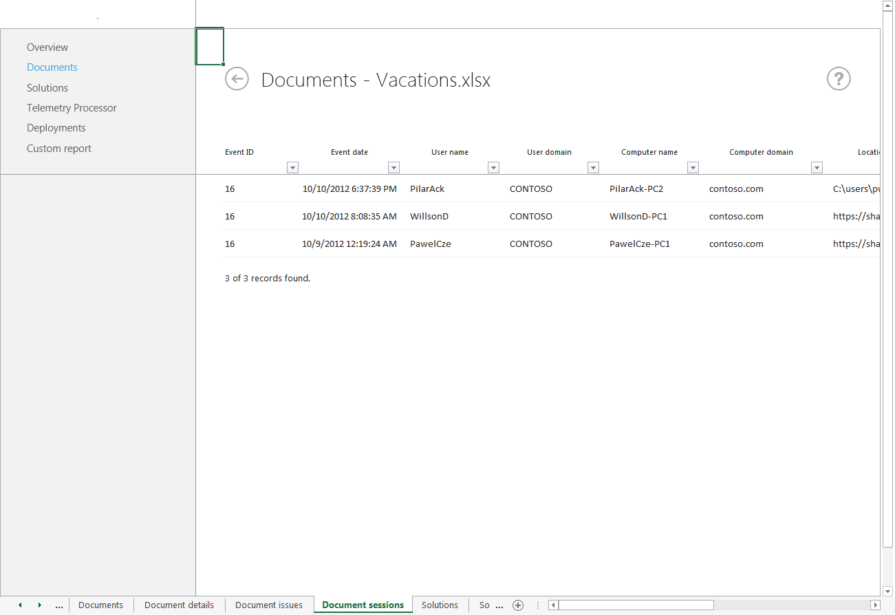
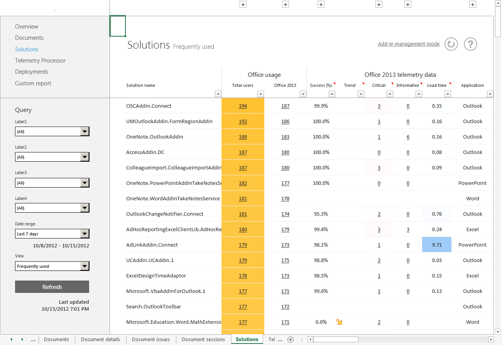
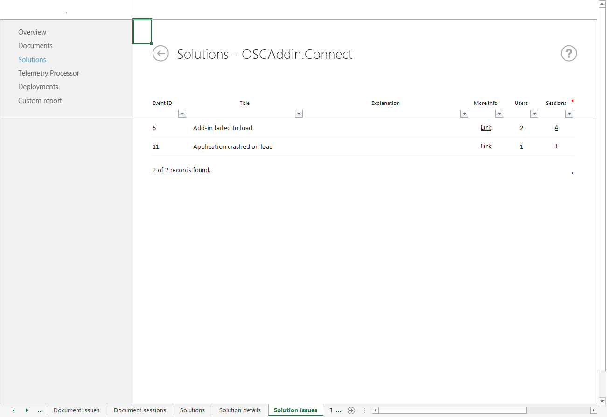
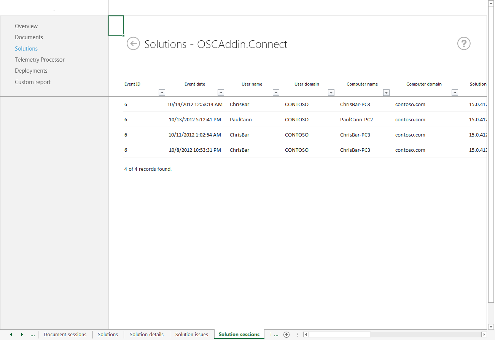
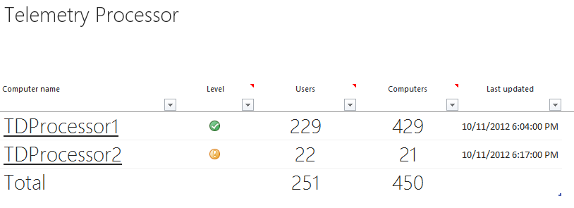
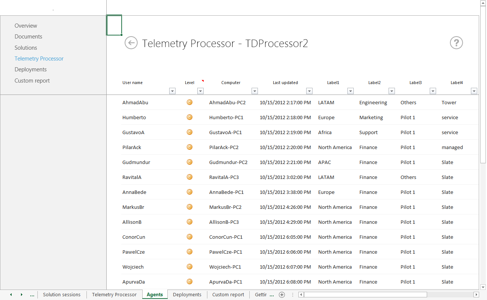
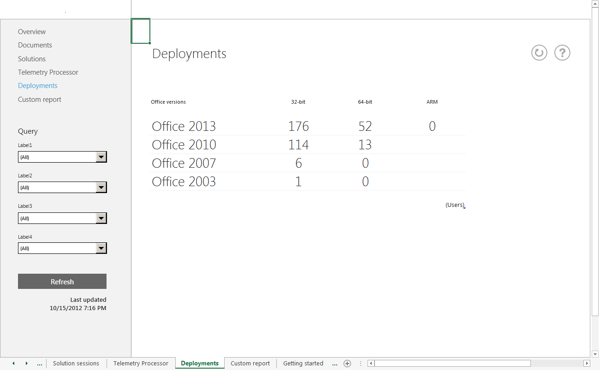

# Telemetry Dashboard worksheet reference

 **Summary:** Find reference information about Telemetry Dashboard worksheets that helps you understand Office stability in your organization. 
  
 **Audience:** IT Professionals 
  
As you use Telemetry Dashboard to investigate stability issues for Office documents and Office solutions, you might need more information about the data that is displayed in the worksheets. Use this article as a reference guide to help understand the data that is shown in Telemetry Dashboard. This data helps you identify stability issues for Office documents and solutions and helps you track Office deployments. You can also use this data to identify problems with the telemetry agents and processors.
  
     

## Overview worksheet

The **Overview** worksheet provides a big picture view of both the stability and deployment status of Office within your organization. By using this worksheet, you can quickly understand how your critical documents and solutions are behaving on users' computers. Instead of browsing the **Documents** and **Solutions** worksheets, which show you item-by-item status, you can open and refresh the **Overview** worksheet to see a high-level view of document and solution stability. The following screen shot shows the Overview worksheet: 
  
**Overview worksheet in Telemetry Dashboard**

  
There are three primary tasks that you can perform on the **Overview** worksheet.
  
- [Determine the overall stability of Office 2016 documents and solutions throughout your organization](monitor-office-compatibility-and-deployments-by-using-telemetry-dashboard.md#stability)
    
- [Drill down to investigate unstable documents or solutions that require your attention](monitor-office-compatibility-and-deployments-by-using-telemetry-dashboard.md#investigate)
    
- [View the progress of Office 2016 deployments in your organization](monitor-office-compatibility-and-deployments-by-using-telemetry-dashboard.md#deploystatus)
    

## Documents worksheet

The **Documents** worksheet in Telemetry Dashboard displays the list of documents that was collected by telemetry logging and by Telemetry Agent scans. In this worksheet, you can find frequently used documents and telemetry data about them. 
  
The following screen shot shows the **Documents** worksheet. 
  
**Documents worksheet in Telemetry Dashboard**

  
There are two main sections on the Documents worksheet:
  
- **Office usage**
    
- **Office 2016 telemetry data**
    
The columns under the **Office usage** section display usage data that is collected by the Telemetry Agent. You can select the link for the number of users of a document to see who is using the document. This information is displayed in the **Document details** worksheet. 
  
The columns under the **Office 2016 telemetry data** section display telemetry data that is collected by telemetry logging. You can select the link for the number of users who hit critical or informative issues to see more details. This information is displayed in the **Document issues** worksheet. 
  
The following table describes each column in the **Documents** worksheet. 
  
> [!NOTE]
> By default, some columns are collapsed and not visible. Select the [+] symbols on the top row to expand the columns. 
  
**Column descriptions for the Documents worksheet in Telemetry Dashboard**

|**Section**|**Column**|**Description**|
|:-----|:-----|:-----|
|Office usage    |File name    |Shows the file name of each document.    |
||Total users    |Shows the number of users who opened each document by using Office 2003, Office 2007, Office 2010, Office 2013, and Office 2016    |
||Office 2003    |Shows the number of users who opened each document by using Office 2003.    |
||Office 2007    |Shows the number of users who opened each document by using Office 2007.    |
||Office 2010    |Shows the number of users who opened each document by using Office 2010.    |
||Office 2013    |Shows the number of users who opened each document by using Office 2013.    |
||Office 2016    |Shows the number of users who opened each document by using Office 2016.    |
||Office 2003 (computers)    |Shows the number of computers on which users opened each document by using Office 2003    |
||Office 2007 (computers)    |Shows the number of computers on which users opened each document by using Office 2007.    |
||Office 2010 (computers)    |Shows the number of computers on which users opened each document by using Office 2010.    |
||Office 2013 (computers)    |Shows the number of computers on which users opened each document by using Office 2013.    |
||Office 2016 (computers)    |Shows the number of computers on which users opened each document by using Office 2016.    |
|Office 2016 telemetry data    |Success (%)    |Shows the percentage of successfully opened documents (no critical errors occurred) out of the total number of sessions.    |
||Sessions    |Shows the total number of sessions. A session refers to all selected file open events.    |
||Trend    |Shows the trend of changes that occurred between the current week and a week within the selected period. You can change the period by using the **Date range** filter in the navigation pane. For example, if you select **1 year** from the **Date range**, the column shows a trend that compares the current week to a week from one year prior.    |
||Critical    |Shows the number of users who encountered critical issues.    |
||Critical issues    |Shows the number of unique critical issues.    |
||Informative    |Shows the number of users who encountered informative issues.    |
||Informative issues    |Shows the number of unique informative issues.    |
||Application    |Shows the name of the application that was used to open each document.    |
||Extension    |Shows the file name extensions that were used to open each document.    |
||Built-in    |Indicates whether each document is included with Office or has a default file name that is used for Office documents. You can use the filter for this column to hide built-in documents so that you can see the unique documents in your organization.    |
   
The following sections describe worksheets that help you drill down into specific issues. These worksheets appear after you select links within the **Documents** worksheet. 
  

## Document details worksheet

The **Document details** worksheet appears after you select a link under **Office usage** on the **Documents** worksheet. The **Document details** worksheet helps you see which users are frequently using a document. 
  
The following screen shot shows the **Documents details** worksheet. 
  
**Document details worksheet in Telemetry Dashboard**

  
The following table describes each column in the **Document details** worksheet. 
  
**Column descriptions for the Documents details worksheet in Telemetry Dashboard**

|**Column**|**Description**|
|:-----|:-----|
|User name    |Displays the name of the user who used the document.    |
|User domain    |Displays the domain name for this user.    |
|Computer name    |Displays the computer name that was used to open the document.    |
|Computer domain    |Shows the computer's domain name.    |
|Location    |Shows the file path of the document.      Only one file path is kept per user and computer. If the same user opens the document from a different file path on the same computer, Office Telemetry keeps only the most recent file path.    |
|Size (KB)    |Shows the file size of the document.    |
|Author    |Shows the author name of the document.    |
|VBA    |Indicates whether the document contains VBA code.    |
|OLE    |Indicates whether the document contains OLE objects.    |
|External data connection    |Indicates whether the document has an external data connection.    |
|ActiveX control    |Indicates whether the document contains ActiveX controls.    |
|Assembly reference    |Indicates whether the document contains VSTO document-level customizations.    |
|Last loaded    |Indicates when the document was most recently loaded.    |
|Title    |Shows the title of the document.    |
|Office version    |Shows the version of Office that was used to open the document.    |
   

## Document issues worksheet

The **Document issues** worksheet appears after you select a link under **Office 2016 telemetry data** on the **Documents** worksheet. The **Document issues** worksheet helps you find details about unique events that were found for a document. 
  
The following screen shot shows the **Document issues** worksheet. 
  
**Document issues worksheet in Telemetry Dashboard**

  
The following table describes each column in the **Document issues** worksheet. 
  
**Column descriptions for the Documents issues worksheet in Telemetry Dashboard**

|**Column**|**Description**|
|:-----|:-----|
|Event ID    |Displays the Event ID. For more information about the event IDs, see "Table 2. Types of events displayed in the Telemetry Log" in [Troubleshooting Office files and custom solutions with the Office Telemetry Log](https://go.microsoft.com/fwlink/p/?LinkId=260532).    |
|Title    |Shows the title of the issue.    |
|Explanation    |Describes the issue.    |
|More info    |Provides a link to more information.    |
|Users    |Shows total number of users who encountered the issue.    |
|Sessions    |Shows total number of sessions that encountered the issue.    |
   

## Document sessions worksheet

The **Document sessions** worksheet shows the sessions during which an issue occurred. You can open this worksheet by selecting a link in the **Sessions** column of the **Document issues** worksheet. 
  
The following screen shot shows the **Documents sessions** worksheet. 
  
**Document sessions worksheet in Telemetry Dashboard**

  
The following table describes each column in the **Document sessions** worksheet. 
  
**Column descriptions for the Documents sessions worksheet in Telemetry Dashboard**

|**Column**|**Description**|
|:-----|:-----|
|Event ID    |Displays the Event ID. For more information about the event IDs, see "Table 2. Types of events displayed in the Telemetry Log" in [Troubleshooting Office files and custom solutions with the Office Telemetry Log](https://go.microsoft.com/fwlink/p/?LinkId=260532).    |
|Event date    |Shows the date and time when the issue occurred.    |
|User name    |Shows the names of users who were using the document that encountered the issue.    |
|User domain    |Shows the domain name for the user.    |
|Computer name    |Shows the name of the computer where the document encountered the issue.    |
|Computer domain    |Shows the computer's domain name.    |
|Location    |Shows the file path where the selected document was opened.      Only one file path is kept per user and computer. If the same user opens the document from a different file path on the same computer, Office Telemetry keeps only the most recent file path.    |
|Office version    |Shows the version of Office that was used to open this document.    |
|Documents loaded    |Shows the list of documents that were being used when the issue occurred.    |
|Size (KB)    |Shows the size of the document.    |
|Author    |Shows the name of the author of the document.    |
|VBA    |Indicates whether the document contains VBA code.    |
|OLE    |Indicates whether the document contains OLE objects.    |
|External data connection    |Indicates whether the document has an external data connection.    |
|ActiveX control    |Indicates whether the document contains ActiveX controls.    |
|Assembly reference    |Indicate whether the document contains VSTO document-level customization.    |
|Title    |Shows the title of the document.    |
   

## Solutions worksheet

The **Solutions** worksheet displays the list of solutions that was collected by telemetry logging and telemetry agent scans. In this worksheet, you can find frequently used solutions and telemetry data about them. The kinds of solutions that are shown include COM add-ins, application-specific add-ins, and apps for Office. 
  
The following screen shot shows the **Solutions** worksheet. 
  
**Solutions worksheet in Telemetry Dashboard**

  
After telemetry data is collected, you can manage Office add-ins by using the **Add-in management mode** link on the **Solutions** worksheet. For more information, see [Let's manage add-ins using Telemetry Dashboard](https://go.microsoft.com/fwlink/p/?LinkId=271236).
  
There are two main sections on the **Solutions** worksheet: 
  
- **Office usage**
    
- **Office 2016 telemetry data**
    
The columns under the **Office usage** section display the usage data that is collected by the telemetry agent. You can select the link for the number of users of a solution to see who is using the solution. This information is displayed on the **Solution details** worksheet. 
  
The columns under the **Office 2016 telemetry data** section display telemetry data that is collected by telemetry logging. You can select the link for the number of users who hit critical or informative issues to see more details. This information is displayed on the **Solution issues** worksheet. 
  
The following table describes each column in the **Solutions** worksheet. 
  
> [!NOTE]
> By default, some columns are collapsed and not visible. Select the [+] symbols on the top row to expand the columns. 
  
**Column descriptions for the Solutions worksheet in Telemetry Dashboard**

|**Section**|**Column**|**Description**|
|:-----|:-----|:-----|
|Office usage    |Total users    |Shows the number of users who use the solution in Office 2003, Office 2007, Office 2010, Office 2013, and Office 2016.    |
||Office 2003    |Shows the number of users who use the solution in Office 2003.    |
||Office 2007    |Shows the number of users who use the solution in Office 2007.    |
||Office 2010    |Shows the number of users who use the solution in Office 2010.    |
||Office 2013    |Shows the number of users who use the solution in Office 2013.    |
||Office 2016    |Shows the number of users who use the solution in Office 2016.    |
||Total computers    |Shows the number of computers where the solution was opened by using Office 2003, Office 2007, Office 2010, Office 2013, and Office 2016.    |
||Office 2003 (computers)    |Shows the number of computers where the solution was opened by using Office 2003.    |
||Office 2007 (computers)    |Shows the number of computers where the solution was opened by using Office 2007.    |
||Office 2010 (computers)    |Shows the number of computers where the solution was opened by using Office 2010.    |
||Office 2013 (computers)    |Shows the number of computers where the solution was opened by using Office 2013.    |
||Office 2016 (computers)    |Shows the number of computers where the solution was opened by using Office 2016.    |
|Office 2016 telemetry data    |Success (%)    |Shows the percentage of successfully opened solutions (no critical error occurred) out of total sessions.    |
||Sessions    |Shows the total number of sessions. A session refers to all selected file open events.    |
||Trend    |Shows the trend of changes that occurred between this week and a week within the selected period. You can change the period by using the **Date range** filter in the navigation pane. For example, if you select **1 year** from the **Date range**, the column shows a trend that compares this week to a week from one year prior.    |
||Critical    |Shows the number of users who encountered critical issues    |
||Critical issues    |Shows the number of unique critical issues.    |
||Informative    |Shows the number of users who encountered informative issues.    |
||Informative issues    |Shows the number of unique informative issues.    |
||Load time    |Shows the average load time of the solution.    |
||Application    |Shows the application name that was used to open the selected solution.    |
||Type    |Shows the solution type.    |
||File    |Shows the file name of the solution.    |
||Extension    |Shows the file name extensions of the solution.    |
||Publisher    |Shows the publisher of the solution.    |
||Built-in    |Indicates whether this solution is included with Office. You can use the filter for this column to hide built-in solutions so that you can see the unique solutions in your organization.    |
   
The following sections describe worksheets that help you drill down into specific issues. These worksheets appear after you select links within the **Solutions** worksheet. 
  

## Solution details worksheet

The **Solution details** worksheet appears after you select a link under **Office usage** on the **Solutions** worksheet. The **Solution details** worksheet helps you see which users are frequently using a solution. 
  
The following screen shot shows the **Solution details** worksheet. 
  
**Solution details worksheet in Telemetry Dashboard**

  
The following table describes each column in the **Solution details** worksheet. 
  
**Column description for the Solution details worksheet**

|**Column**|**Description**|
|:-----|:-----|
|User name    |Shows the name of user who used the solution.    |
|User domain    |Shows the domain name for this user.    |
|Computer name    |Shows the name of the computer where the solution was opened.    |
|Computer domain    |Shows the computer's domain name.    |
|Solution version    |Shows the version of the solution.    |
|Architecture    |Shows the architecture of the solution.    |
|Load time    |Shows how long the solution took to load.    |
|Last loaded    |Shows the last time that the solution was loaded.    |
|Load behavior    | Shows the load behavior of COM add-ins as follows:      **0**  Do not load automatically (Unloaded)    **1**  Do not load automatically (Loaded)    **2**  Load at startup (Unloaded)    **3**  Load at startup (Loaded)    **8**  Load on demand (Unloaded)    **9**  Load on demand (Loaded)    **16**  Load first time, then load on demand (Loaded)       For more information, see [Load behavior values](https://go.microsoft.com/fwlink/p/?LinkId=272180).    |
|Policy setting    |Shows the policy setting.    |
|Office version    |Shows the Office version that was used to open the solution.    |
|Publisher    |Shows the publisher of the solution.    |
|Author    |Shows the author name of the solution.    |
|Friendly name    |Shows the friendly name of the solution.    |
|Description    |Shows the description of the solution.    |
|Size (KB)    |Shows the size of the solution.    |
|Location    |Shows the file path of the solution.Only one file path is kept per user and computer. If the same user opens the solution from different file path on the same computer, Office Telemetry keeps only the most recent file path.    |
   

## Solution issues worksheet

The **Solution issues** worksheet appears after you select a link under **Office 2016 telemetry data** on the **Solutions** worksheet. The **Solution issues** worksheet helps you find details about the unique events that were found for a solution. 
  
The following screen shot shows the **Solution issues** worksheet. 
  
**Solution issues worksheet in Telemetry Dashboard**

  
The following table describes each column in the **Solution issues** worksheet. 
  
**Column descriptions for the Solution issues worksheet in Telemetry Dashboard**

|**Column**|**Description**|
|:-----|:-----|
|Event ID    |Displays the Event ID. For more information about the event IDs, see "Table 2. Types of events displayed in the Telemetry Log" in [Troubleshooting Office files and custom solutions with the Office Telemetry Log](https://go.microsoft.com/fwlink/p/?LinkId=260532).    |
|Title    |Shows the title of the issue.    |
|Explanation    |Describes the issue.    |
|More info    |Provides a link to more information.    |
|Users    |Shows the number of users who encountered the issue.    |
|Sessions    |Shows the number of sessions that encountered the issue.    |
   

## Solution sessions worksheet

The **Solution sessions** worksheet shows the sessions during which the issue occurred. You can open this worksheet by selecting a link in the **Sessions** column of the **Solution issues** worksheet. 
  
The following screen shot shows the **Solution sessions** worksheet. 
  
**Solution sessions worksheet in Telemetry Dashboard**

  
The following table describes each column in the **Solution sessions** worksheet. 
  
**Column descriptions for the Solution sessions worksheet in Telemetry Dashboard**

|**Column**|**Description**|
|:-----|:-----|
|Event ID    |Displays the Event ID. For more information about the event IDs, see "Table 2. Types of events displayed in the Telemetry Log" in [Troubleshooting Office files and custom solutions with the Office Telemetry Log](https://go.microsoft.com/fwlink/p/?LinkId=260532).    |
|Event date    |Shows the date and time when the issue occurred.    |
|User name    |Shows the names of users who were using the solution that encountered the issue.    |
|User domain    |Shows the domain name for the user.    |
|Computer name    |Shows the name of the computer where the solution encountered the issue.    |
|Computer domain    |Shows the computer's domain name.    |
|Solution version    |Shows the version of the solution.    |
|Architecture    |Shows the architecture of the solution.    |
|Office version    |Shows the Office version with build numbers that used this solution.    |
|Load time    |Shows how long the solution took to load.    |
|Load behavior    | Shows the load behavior of COM add-ins as follows:      **0**  Do not load automatically (Unloaded)    **1**  Do not load automatically (Loaded)    **2**  Load at startup (Unloaded)    **3**  Load at startup (Loaded)    **8**  Load on demand (Unloaded)    **9**  Load on demand (Loaded)    **16**  Load first time, then load on demand (Loaded)       For more information, see [Load behavior values](https://go.microsoft.com/fwlink/p/?LinkId=272180).    |
|Policy setting    |Shows the policy setting.    |
|Document loaded    |Shows the documents that were open when the issue occurred.    |
|Publisher    |Shows the publisher of the solution.    |
|Author    |Shows the author name of the solution.    |
|Friendly name    |Shows the friendly name of the solution.    |
|Description    |Shows the description of the solution.    |
|Size (KB)    |Shows the size of the solution.    |
|Location    |Shows the file path of the solution.      Only one file path is kept per user and computer. If the same user opens the solution from a different file path on the same computer, Office Telemetry keeps only the most recent file path.    |
   

## Telemetry Processor worksheet

The **Telemetry Processor** worksheet displays information about the health of the Office Telemetry infrastructure. You can monitor whether Telemetry Processors are running correctly, and you can check whether users' computers are sending telemetry data correctly. 
  
The following screen shot shows the **Telemetry Processor** worksheet: 
  
**Telemetry Processor worksheet in Telemetry Dashboard**

  
The following table describes each column in the **Telemetry Processor** worksheet. 
  
**Column descriptions for the Telemetry Processor worksheet in Telemetry Dashboard**

|**Column**|**Description**|
|:-----|:-----|
|Computer name    |Lists the names of computers that are running Telemetry Processor. You can select the computer name to see the users whose computers are sending telemetry data to each Telemetry Processor. For more information about this feature, see the **Agents** worksheet later in this article.    |
|Level    |Shows the status of the Telemetry Processor. Depending on the status, you might want to investigate if the Telemetry Processor is running correctly or if the agents on users' computers are configured correctly and uploading data.      The levels are described in the next table.    |
|Users    |Shows the number of users whose computers are connected to each Telemetry Processor.    |
|Computers    |Shows the number of computers that connected to each Telemetry Processor.    |
|Last updated    |Shows the last date and time when the Telemetry Processor inserted data into the database.    |
   
The following table describes the status that is represented by the symbols that are displayed in the **Level** column. 
  
**Icon descriptions for the Level column in the Telemetry Processor worksheet**

|**Symbol**|**Status description**|
|:-----|:-----|
||The last updated date and time for the Telemetry Processor is less than a day ago.    |
||5% or more of the users for this Telemetry Processor have not uploaded data for the last 14 days. Select the Telemetry Processor name to open the **Agents** worksheet so that you can view which users' computers are not sending telemetry data.    |
||The last updated date and time for the Telemetry Processor is older than a day. When you see this status, you should investigate whether the Telemetry Processor is running correctly on the computer.     You find information about how to troubleshoot Telemetry Processor in [Troubleshooting Telemetry Dashboard deployments](deploy-telemetry-dashboard.md#tshooting).    |
|(No symbol)    |The last updated date and time for the Telemetry Processor was more than 14 days ago.    |
   
> [!NOTE]
> A Telemetry Processor is deleted from the **Telemetry Processors** worksheet if the **Last updated** value for the Telemetry Processor is 90 or more days ago. 
  

## Agents worksheet

The **Agents** worksheet displays information about the users whose computers who are uploading data to each Telemetry Processor. You can open the **Agents** worksheet by selecting a link for a computer name on the **Telemetry Processor** worksheet. Use this worksheet to monitor the upload status of each computer. 
  
The following screen shot shows the **Agents** worksheet. 
  
**Agents worksheet in Telemetry Dashboard**

  
The following table describes each column in the **Agents** worksheet. 
  
**Column descriptions for the Agents worksheet in Telemetry Dashboard**

|**Column name**|**Description**|
|:-----|:-----|
|User name    |Lists the names of users whose computers upload telemetry data to the Telemetry Processor.    |
|Level    |Indicates how recently the agent uploaded data. The levels are described in the next table.    |
|Computer    |Lists the names of the computers that upload telemetry data.    |
|Last updated    |Shows the last date and time when the user's computer uploaded data.    |
|Label 1 - 4    |Shows the tag values that are assigned to each user.    |
|Version    |Shows the major and minor version of Telemetry Agent that runs on the user's computer.    |
   
The following table describes the status that is represented by the symbols that are displayed in the **Level** column. 
  
|**Symbol**|**Status description**|
|:-----|:-----|
||The last updated date and time for the user is less than a day ago.    |
||The last updated date and time for the user is between 2 and 14 days ago. Occasionally, you will see this icon when the user's computer has not uploaded data for more than a day (for example, Monday morning after the weekend).    |
||The last updated date and time for the user is between 15 and 30 days ago. When you see this status, you should investigate whether the Telemetry Agent on this user's computer is configured correctly.      You find information about how to troubleshoot Telemetry Agents in [Troubleshooting Telemetry Dashboard deployments](deploy-telemetry-dashboard.md#tshooting).    |
|(No symbol)    |The last updated date and time for the Telemetry Processor was 31 or more days ago.    |
   
> [!NOTE]
> A user is deleted from the **Agents** worksheet if the **Last updated** value for the user was 90 or more days ago. 
  

## Deployments worksheet

The **Deployments** worksheet provides a tabular view of the number of Office clients that are deployed in your organization. This worksheet provides additional information for the deployment trend chart that is shown in the **Overview** worksheet. This information can help you plan for future Office deployments. 
  
In the following screen shot of the **Deployments** worksheet, you can see how many Office clients are deployed. The list is organized by Office version and CPU architecture. For example, you can see how many users are running 32-bit versions of Office. 
  
**Deployments worksheet in Telemetry Dashboard**

  
You can see that there are still 32-bit computers that are running Office 2003. You may want to contact these users to understand if they have any concerns about how to upgrade. You can also create a custom report to show more information about these users, such as their computer hardware.
  
Also, you should be aware that Windows 8 is now supported on ARM-based architectures. If your organization has users who have Office on these computers, you can now keep track of that information in the **Deployments** worksheet. You can create custom reports to obtain richer information about who is using these computers, what issues they may be experiencing, and so on. 
  

## Custom report worksheet

When you select the **Create custom report** button on the **Custom report** worksheet, Telemetry Dashboard connects to multiple tables and creates relationships for you to use in a PivotTable. If you have never used a PivotTable before, you can learn more in [Tutorial: PivotTable data analysis using a Data Model in Excel](https://go.microsoft.com/fwlink/?LinkID=279531). 
  
## Related topics
[Compatibility and telemetry in Office](compatibility-and-telemetry-in-office.md)
  
[Deploy Telemetry Dashboard](deploy-telemetry-dashboard.md)

