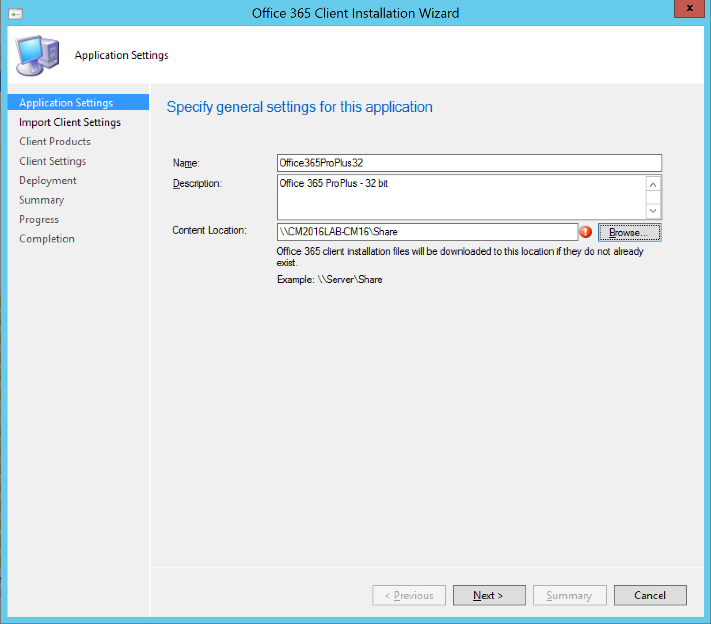
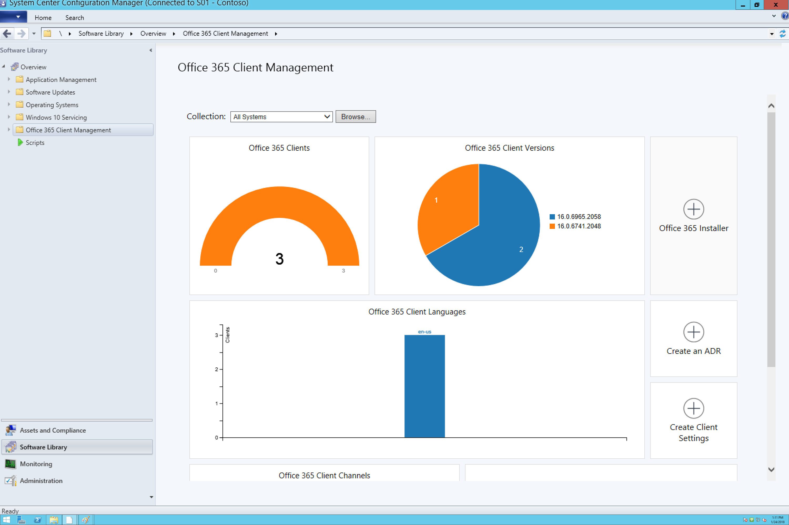

# Deploy Office 365 ProPlus with System Center Configuration Manager (Current Branch)

Follow the steps in this article to deploy Office 365 ProPlus to System Center Configuration Manager (Current Branch).

## Before you begin
- If you haven't already, complete the [asssessment](assess-office-365-proplus.md) and [planning](plan-office-365-proplus.md) for deploying Office 365 ProPlus.
- This article assumes you already use Configuration Manager. If you're not familiar with it, see  [Introduction to System Center Configuration Manager](https://docs.microsoft.com/en-us/sccm/core/understand/introduction). 
- Make sure your client devices have Internet access to authentiate Office 365 ProPlus after installation.  
- End-users who run the Office 365 Installer on the client computer must have administrator priviledges on their device as well as **Read** and **Write** access to the content location share provided in the Configuration Manager wizard.
> [!IMPORTANT]
> FROM CHRIS: is the end user running the installer in this case?  I think this is not a requirement because the system is running the installer via the ConfigMgr agent.

## Step 1 - Review and update your Configuration Manager infrastructure
From an infrastructure standpoint, deploying Office 365 ProPlus with Configuration Manager is similar to other software deployments and doesn't require any special configuration. There are, however, a couple points to consider:

- If you're not already, we recommend you use the Current Branch of Configuration Manager. With this version, you can deploy and manage Office from the Office Client Management dashboard. For more details on the Current Branch, see [Which branch of Configuration Manager should I use?](https://docs.microsoft.com/en-us/sccm/core/understand/which-branch-should-i-use)

- Peer Cache is a feature in the Current Branch of Configuration Manager that can help with limited network capacity when deploying to  client devices in remote locations. When you enable it for client devices, they can share content with other clients directly from their local cache. For more details, see [Peer Cache for Configuration Manager clients](https://docs.microsoft.com/en-us/sccm/core/plan-design/hierarchy/client-peer-cache).

> [!NOTE]
> **Best practice:** Use the Current Branch of Configuration Manager and enable peer cache on client devices. When deploying Office, use the Office Client Management dashboard in Configuration Manager.

## Step 2 - Implement your Group Policy settings   
Make sure that you have reviewed and approved the group policy settings as part of your deployment plan, and then implement the settings. For more details, see [Best practices: Implementing group policy](best-practices/best-practices-implementing-group-policy.md).

## Step 3 - Review your collections   
The deployment groups that you defined in your deployment plan are represented as collections in Configuration Manager.  For each deloyment group, make sure you have a specific collection. For more details on creating and managing collections, see [Introduction to collections in System Center Configuration Manager](https://docs.microsoft.com/en-us/sccm/core/clients/manage/collections/introduction-to-collections). 

## Step 4 - Remove existing versions of Office  
> [!IMPORTANT]
> REVIEWERS: I'm not sure how to tackle this procedure without taking away all the simplicity we've been adding to Configuration Manager deployment of Office. As far as I can tell, it requires (1) getting the two versions of OffScrub, (2) adding those versions to each Office package, (3) updating the task sequence that installs Office to also remove Office, first. If an admin does that, they can no longer use the built-in Office installer wizard to deploy Office, right? Or am I missing something?

> [!IMPORTANT]
> FROM CHRIS: We should not include or recommend Offscrub in this document.  This is not supported by the product team thus not part of our deployment toolset or experience. I would include this section but I would focus it on how to deal with devices that may have a copy of Office (past or present versions) already installed, pointing out that certain applications do not work SxS and we do not recommend SxS and to take necessary actions to uninstall (for the cases that C2R will not uninstall).  Keep in mind that we are making changes to C2R this year to build this into the product so we could update this article later to reflect these changes).

## Step 5 - Create and deploy the Office applications   
For each deloyment group that you defined in your deployment plan, create a unique Office application using the steps below. For example, if you have four deployment groups, you'll create four Office applications and deploy them to four different collections.
> [!IMPORTANT]
> REVIEWERS: I have screen shots for all the steps below, but I think it's overkill. Let me know if you think it's warranted.

1. In the Configuration Manager console, navigate to **Software Library** > **Overview** > **Office 365 Client Management**.
2. Click **Office 365 Installer** in the upper-right pane. The Office 365 Client Installation Wizard opens.
3. On the **Application Settings** page, provide a name and description for the app, enter the download location for the files, and then click **Next**. The location must be specified as &#92;&#92;*server*&#92;*share*.
4. On the **Import Client Settings** page, choose whether to import the Office 365 client settings from an existing XML configuration file or to manually specify the settings, and then click **Next**.  

    When you have an existing configuration file, enter the location for the file and skip to step 7. You must specify the location in the form &#92;&#92;*server*&#92;*share*&#92;*filename*.XML.
    > [!IMPORTANT]    
    > The XML configuration file must contain only [languages supported by the Office 365 ProPlus client](https://technet.microsoft.com/library/cc179219&#40;v=office.16&#41;.aspx).

5. On the **Client Products** page, select the Office 365 suite that you use. Select the applications that you want to include. Select any additional Office products that should be included, and then click **Next**.
6. On the **Client Settings** page, choose the settings to include, and then click **Next**.
7. On the **Deployment** page, select **Yes** to deploy the application, and then click **Next**.
    > [!NOTE]
    > If you choose not to deploy the package in the wizard, you can deploy or edit the application later from **Software Library** > **Overview** > **Application Management** > **Applications**. For details on deploying an application, see [Create and deploy an application](/sccm/apps/get-started/create-and-deploy-an-application).
8. On the **General** page, choose a collection to deploy to, and then click **Next**. The collection should match the deployment group that receives the Office application you just defined.
9. On the **Content** page, choose distribution points to host the content, and then click **Next**. 
10. On the **Deployment Settings** page, choose how the software should be deployed, and then click **Next**. 
11. On the **Scheduling** page, specify when the application should be made available, and then click **Next**.
12. On the **User Experience** page, choose the type of notifications and installation experience, and then click **Next**.
13. On the **Summary** page, review the settings, and then click **Next**.
14. On the **Alerts** page, choose the type of alerts you want, and then click **Next**.
15. On the **Confirm the settings** page, review the application settings, and then click **Close**.
16. Repeat this process for each Office application you want to create and deploy--so, once for each deployment group you defined.

> [!IMPORTANT]
> REVIEWERS: It seems more likely that users will click **No** on the deployment page--instead, they'll create their Office applications and then deploy them later. If they do that, though, it seems like they can't use the Office installer for the second part--they just need to go through the standard application deployment wizard. Is that correct? It seems problematic to give admins steps that render part of our Office Installer wizard useless.

> [!IMPORTANT]
> FROM CHRIS: The wizard creates an Application that can be deployed at another time or incorporated into a Task Sequence.

> [!IMPORTANT]
> After you create and deploy Office 365 ProPlus using the Office 365 Installer, Configuration Manager will not manage the Office updates by default. If you want to enable Office 365 clients to receive updates from Configuration Manager, see [Manage updates to Office 365 ProPlus with System Center Configuration Manager](manage-updates-to-office-365-proplus-with-system-center-configuration-manager.md).

> [!IMPORTANT]
> FROM CHRIS: This is why I made the comment at the top of the doc about managing updates.  This is obviously a setting to set during deployment and if you want to manage updates yourself then there is a whole set of other practices to follow for that.

## Review exit criteria
To make sure you have deployed the correct Office package to your client devices, you can use the Office 365 Client Management dashboard. This dashboard provides charts for the following information:

- Number of Office 365 clients
- Office 365 client versions
- Office 365 client languages
- Office 365 client channels     

To view the Office 365 Client Management dashboard in the Configuration Manager console, go to **Software Library** > **Overview** > **Office 365 Client Management**. At the top of the dashboard, use the **Collection** drop-down setting to filter the dashboard data by members of a specific collection. 

In the dashboard, make sure you see the Office versions, languages, and update channels that you deployed for each collection.

> [!IMPORTANT]
> If the data is not displaying, you might need to enable hardware inventory and select the **Office 365 ProPlus Configurations** hardware inventory class. For more details, see [Configure hardware inventory](\sccm\core\clients\manage\configure-hardware-inventory).

## Next steps
[Manage updates to Office 365 ProPlus with System Center Configuration Manager](manage-updates-to-office-365-proplus-with-system-center-configuration-manager.md)
