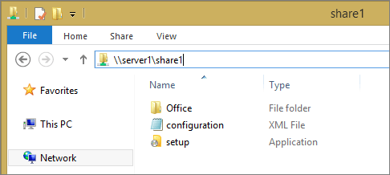
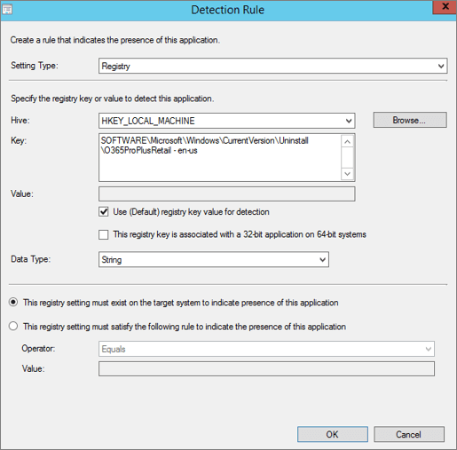

# Deploy Office 365 ProPlus with System Center Configuration Manager (Current Branch)

Follow the steps in this article to deploy Office 365 ProPlus with System Center Configuration Manager (Current Branch).If you haven't already, complete the [asssessment](assess-office-365-proplus.md) and [planning](plan-office-365-proplus.md) phases for your Office deployment. 
    
## Requirements

- The client devices that run the Office 365 ProPlus must have Internet access.  
- The user that runs the Office 365 Installer must have **Read** and **Write** access to the content location share provided in the Configuration Manager wizard.
- If you receive a 404 download error, copy the following files to the user %temp% folder:
  - [releasehistory.xml](http://officecdn.microsoft.com/pr/wsus/releasehistory.cab)
  - [o365client_32bit.xml](http://officecdn.microsoft.com/pr/wsus/ofl.cab)  
- All requirements met in the [asssessment](assess-office-365-proplus.md) and [planning](plan-office-365-proplus.md) phases for your Office deployment. 

## Best practices 

The steps in this article are based on the following best practices and options:
  
Best practices:

- **Deploy Office with Configuration Manager (Current Branch)**. For more details, see [Choose how to deploy](plan-office-365-proplus.md#step-1---choose-how-to-deploy).
- **Manage updates to Office automatically**, without any adminstrative overhead. For more details, see [Chose how to manage updates](plan-office-365-proplus.md#step-2---choose-how-to-manage-updates). (If you want to manage updates from a local source, you need to change the configuration files. For more details, see [configuring updates](configuration-options-for-the-office-2016-deployment-tool.md#updates-element)).
- **Build two Office installation packages**: Semi-Annual Channel for 32-bit and Semi-Annual Channel (Targeted) for 32-bit. Each installation package includes all the core Office apps. (If you want to deploy the 64-bit version of Office, you can create additional installation packages.) For more details, see [Define your source files](plan-office-365-proplus.md#step-4---define-your-source-files).
- **Deploy to two deployment groups**: a pilot group that receives the Semi-Annual Channel (Targeted) and a broad group that recieves the Semi-Annual Channel. Note that in this scenario, the installation packages and deployment groups match exactly. In more complex deployments, you might have multiple deployment groups that use the same installation package. For more details, see [Choose your update channels](plan-office-365-proplus.md#step-3---choose-your-update-channels).

Options:

- **Install Office in English and Japanese**. For more details on installing additional languages, including matching the language of the client device's operating system, see [Overview of deploying languages](overview-of-deploying-languages-in-office-365-proplus.md).
- **Install Office silently**. For more details, see [Display options](configuration-options-for-the-office-2016-deployment-tool.md#display-element).
- **Install core Office apps only**. If you want to include Project or Visio, see [Deploy Visio](https://docs.microsoft.com/en-us/deployoffice/deployment-guide-for-visio) and [Deploy Project](https://docs.microsoft.com/en-us/deployoffice/deployment-guide-for-project).

You can change the options as part of the deployment wizard in Configuration Manager, as shown later in the article. 

## Prepare the Office 365 ProPlus installation files to be deployed by Configuration Manager

To get started, download the Office 2016 version of the Office Deployment Tool from the [Microsoft Download Center](http://go.microsoft.com/fwlink/p/?LinkID=626065) to a shared folder on your organization's network. Then, use the Office Deployment Tool to [download the Office 365 ProPlus installation files](overview-of-the-office-2016-deployment-tool.md#BKMK_downloadinstallationfiles) from the Internet to the same shared folder.
  
Next, edit the configuration.xml, and review [Configuration options for the Office Deployment Tool](configuration-options-for-the-office-2016-deployment-tool.md) to decide how you want to install Office 365 ProPlus. The following example shows a configuration.xml that you can use to install the 32-bit, English version of Office 365 ProPlus.
  
```
<Configuration> 
   <Add OfficeClientEdition="32"> 
    <Product ID="O365ProPlusRetail"> 
     <Language ID="en-us" /> 
    </Product> 
   </Add>
   <Display Level="None" AcceptEULA="TRUE" />
</Configuration>
```

It's important that you don't include the SourcePath attribute in the Add section of your configuration.xml file. That's because Configuration Manager copies the installation files for an application into a folder under the Configuration Manager client cache folder, and the name of that subfolder is different for each computer. Because the folder name is different for each computer, you can't specify a SourcePath that will work for every computer that you're deploying Office 365 ProPlus to. Instead, leave out the SourcePath attribute. When a SourcePath isn't specified, the Office Deployment Tool automatically looks for the Office 365 ProPlus installation files in the same folder that the Office Deployment Tool is located. That's why we're including the Office Deployment Tool, the configuration.xml, and the Office 365 ProPlus installation files together in the same shared folder.
  

  
## Create an application for Office 365 ProPlus in Configuration Manager

The next step is to [create an application](https://go.microsoft.com/fwlink/p/?LinkId=535035) in Configuration Manager. An application contains the files and information that Configuration Manager needs to deploy software to a user's computer.
  
 **To create an application**
  
1. In the Configuration Manager console, choose **Software Library** > **Application Management** > **Applications**.
    
2. On the **Home** tab, in the **Create** group, choose ** Create Application**.
    
3. On the **General** page of the Create Application Wizard, select **Manually specify the application information**, and then choose **Next**.
    
4. On the **General information** page, enter a name for the application, enter any optional information, and then choose **Next.**
    
5. On the **Application Catalog** page, provide the information that's appropriate for your environment, and then choose **Next**.
    
6. On the **Deployment Types** page, choose **Next**. We'll add a deployment type later.
    
7. On the **Summary** page, review the settings you've chosen, and then choose **Next** to create the application.
    
8. After the application is created, on the **Completion** page, choose **Close**.
    
## Create a deployment type for the Office 365 ProPlus application in Configuration Manager
<a name="BKMK_DeployType"> </a>

An application in Configuration Manager must contain at least one [deployment type](https://go.microsoft.com/fwlink/p/?LinkId=535030). The deployment type contains the installation files for a software package as well as rules that specify when and how the software is deployed.
  
For the Office 365 ProPlus application, the deployment type includes the following:
  
- The path of the shared folder that contains the Office Deployment Tool, your configuration.xml file, and the Office 365 ProPlus installation files that you downloaded from the Internet. For example, \\\\server1\share1.
    
- The command line that gets the Office Deployment Tool to start the installation of Office 365 ProPlus.
    
- A [detection method](https://go.microsoft.com/fwlink/p/?LinkId=535032), which Configuration Manager uses to determine if Office 365 ProPlus is already installed on the user's computer.
    
 **To create a deployment type**
  
1. In the Configuration Manager console, choose **Software Library** > **Application Management** > **Applications**.
    
2. Select the Office 365 ProPlus application, and then on the **Home** tab, in the **Application** group, choose ** Create Deployment Type**.
    
3. On the **General** page of the Create Deployment Type Wizard, in the **Type** list, select **Script Installer**, and then choose **Next**.
    
4. On the **General Information** page, enter a name for the deployment type, enter any optional information, and then choose **Next.**
    
5. On the **Content** page, do the following:
    
  - In the **Content location** box, enter the network share where you put the Office Deployment Tool, your configuration.xml file, and the Office 365 ProPlus installation files that you downloaded from the Internet.
    
  - In the **Installation program** box, enter the following text: setup.exe /configure configuration.xml
    
    After you enter this information, choose **Next**.
    
6. On the **Detection Method** page, choose **Add Clause**.
    
7. In the **Detection Rule** dialog box, do the following:
    
  - In the **Setting Type** list, select **Registry**.
    
  - In the **Hive** list, select **HKEY_LOCAL_MACHINE**.
    
  - In the **Key** box, enter the following text: Software\Microsoft\Windows\CurrentVersion\Uninstall\O365ProPlusRetail - en-us
    
  - Select the **Use (Default) registry key value for detection** check box.
    
     
  
    After you enter this information, choose **OK**, and then on the **Detection Method** page, choose **Next**.
    
8. On the **User Experience** page, in the **Installation behavior** list, select **Install for system**, and then choose **Next**.
    
9. If you want to specify any requirements or dependencies for the deployment type, choose **Next** to go through those pages in the wizard. Otherwise, choose **Summary**.
    
10. On the **Summary** page, review the settings you've chosen, choose **Next**, and then choose **Close.**
    
## Distribute the Office 365 ProPlus application to distribution points in Configuration Manager
<a name="BKMK_Distribute"> </a>

After you create the Office 365 ProPlus application and configure its deployment type, the next step is to copy all the files needed by the application to the appropriate [distribution points](https://go.microsoft.com/fwlink/p/?LinkId=535033) in your Configuration Manager environment.
  
 **To distribute the application to distribution points**
  
1. In the Configuration Manager console, choose **Software Library** > **Application Management** > **Applications**.
    
2. Select the Office 365 ProPlus application, and then on the **Home** tab, in the **Deployment** group, choose ** Distribute Content**.
    
3. On the **General** page of the Distribute Content Wizard, choose **Next**, and then on the **Content** page, choose **Next**.
    
4. On the **Content Destination** page, choose **Add** > **Distribution Point**, select the appropriate distribution points, and then choose **OK**. Then, select **Next**.
    
5. On the **Summary** page, review the settings you've chosen, and then choose **Next**.
    
6. On the **Confirmation** page, check that the content was successfully assigned to the distribution points, and then choose **Close**.
    
7. To monitor the distribution, go to **Monitoring** > **Distribution Status** > **Content Status**.
    
8. Select the application, and then view the **Completion Statistics**.
    
     
  
## Deploy the Office 365 ProPlus application in Configuration Manager
<a name="BKMK_Deploy"> </a>

After the files for the Office 365 ProPlus application are copied to the appropriate distribution points, the next step is to [deploy the application](https://go.microsoft.com/fwlink/p/?LinkId=535036). When you deploy the application, you specify which computers or users get the application and when.
  
 **To deploy the application**
  
1. In the Configuration Manager console, choose **Software Library** > **Application Management** > **Applications**.
    
2. Select the Office 365 ProPlus application, and then on the **Home** tab, in the **Deployment** group, choose **Deploy**.
    
3. On the **General** page of the Deploy Software Wizard, choose **Browse** for the **Collection** box, and then select which computers or users that you want to deploy Office 365 ProPlus to. After you've made your selection, choose **OK**, and then choose **Next**.
    
4. On the **Content** page, choose **Next** because we've already specified the distribution points for the application.
    
5. On the **Deployment Settings** page, in the **Purpose** list, select **Required**.
    
6. If you want to specify a schedule, configure the user experience, or create an alert, choose **Next** to go through those pages in the wizard. Otherwise, choose **Summary**.
    
7. On the **Summary** page, review the settings you've chosen, and then choose **Next**.
    
8. On the **Confirmation** page, check that the application was successfully deployed, and then choose **Close**.
    
After you deploy the application, a targeted computer becomes aware of the deployed application during the computer's next client policy polling cycle, which is once every sixty minutes by default. Then, the computer downloads the installation files for the application from a distribution point into the Configuration Manager client cache. The installation of Office 365 ProPlus takes place from the client cache and no additional files are downloaded from the network or from the Internet.
  

  
## Related topics
- [Application Management in Configuration Manager](https://go.microsoft.com/fwlink/p/?LinkId=535034)
  

