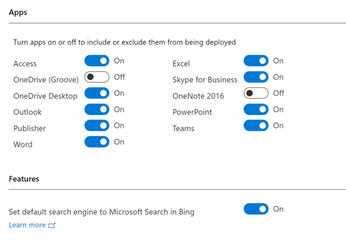
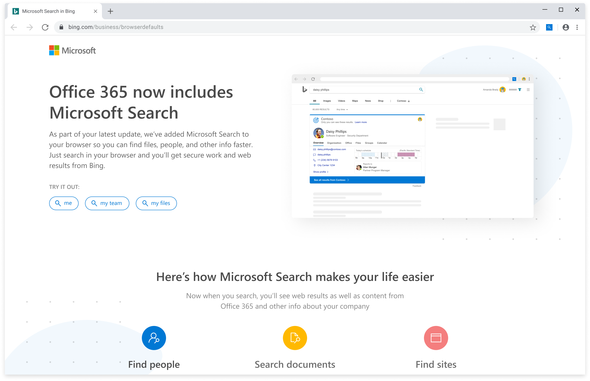
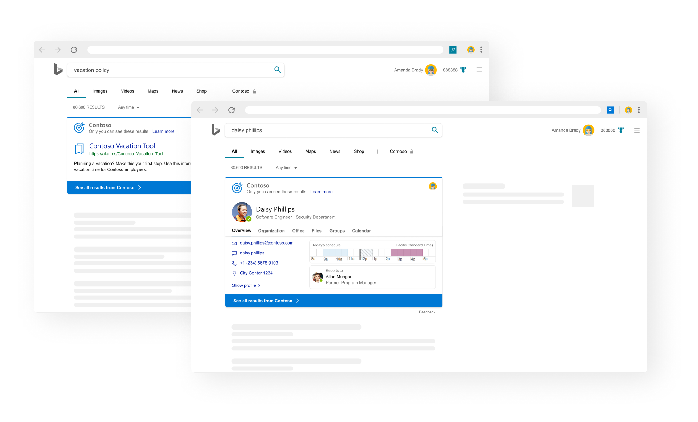
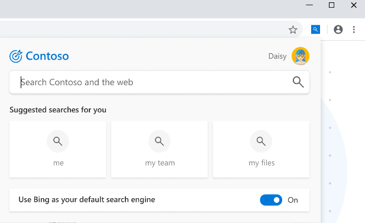

# Microsoft Search in Bing and Office 365 ProPlus

Starting with Version 2002 of Office 365 ProPlus, an extension for Microsoft Search in Bing will be installed that makes Bing the default search engine for the Google Chrome web browser only on devices in certain [locations](#which-locations-will-receive-microsoft-search-in-bing-with-office-365-proplus). This extension will be installed with new installations of Office 365 ProPlus or when existing installations of Office 365 ProPlus are updated.

If you don't want the extension installed, [follow these steps](#how-to-exclude-the-extension-for-microsoft-search-in-bing-from-being-installed). Also, if Bing is already the default search engine, the extension doesn't get installed.

Even after the extension is installed, your users can easily stop using Bing as the default search engine on their own by using a simple [On/Off toggle](#change-whether-bing-is-the-default-search-engine-for-google-chrome) or you can [remove the extension](#how-to-remove-the-extension-after-its-been-installed) from multiple devices in your organization.

By making Bing the default search engine, users in your organization with Google Chrome will be able to take advantage of Microsoft Search, including being able to access relevant workplace information directly from the browser address bar. Microsoft Search is part of Microsoft 365 and is turned on by default for all Microsoft apps that support it.

> [!NOTE]
> - For more information about the business value of Microsoft Search in Bing, [read this blog post](https://techcommunity.microsoft.com/t5/office-365-blog/introducing-and-managing-microsoft-search-in-bing-through-office/ba-p/1110974).
> - Support for the Firefox web browser is planned for a later date. We will keep you informed about support for Firefox through the Microsoft 365 Admin Center and this article.
> - This extension is included only with Office 365 ProPlus. It isn’t included with Office 365 Business, which is the version of Office that is comes with certain business plans, such as the Microsoft 365 Business plan and the Office 365 Business Premium plan.

## What is Microsoft Search in Bing?

Microsoft Search in Bing provides a familiar web interface to help your users find workplace information more easily, including files and documents, internal sites and business tools, people and org charts, building information, and other relevant information from within your organization. Microsoft Search accesses files, SharePoint sites, OneDrive content, Teams and Yammer conversations, and other shared data sources in your organization, as well as the internet.  

> [!NOTE]
> Users must be signed in with their work or school account to receive results from Microsoft Search in Bing. For more information, see [Security and Privacy for Microsoft Search in Bing](https://docs.microsoft.com/microsoftsearch/security-for-search).

Microsoft Search is turned on by default in Microsoft 365, so no initial setup is required. But you can enhance the search experience for your users by adding content, such as bookmarks, Q&As, acronyms, building locations, and floor plans. For more information, see [How to prepare your organization for Microsoft Search in Bing](#how-to-prepare-your-organization-for-microsoft-search-in-bing).

For more information about features and capabilities, see [Microsoft Search in Bing](https://www.bing.com/business/explore) and [Overview of Microsoft Search](https://docs.microsoft.com/microsoftsearch/overview-microsoft-search).

## When will the extension for Microsoft Search in Bing be added to Office 365 ProPlus?

Version 2002 is the first version of Office 365 ProPlus that will install this extension. Version 2002 is expected to be released in Monthly Channel in early March 2020 and will be available in Monthly Channel (Targeted) shortly before then. After that, the extension will then be included in releases of Semi-Annual (Targeted) and Semi-Annual Channel.

The following table shows the tentative schedule for the various update channels.  All the information in the table is tentative and subject to change. We will update the table as specific versions and release dates are determined.


|Update channel      | Version  | Release date  |
|---------|---------|---------|
|Monthly Channel (Targeted) | *Version 2002*  | *Middle of February 2020* |
|Monthly     | *Version 2002*  | *Early March 2020* |
|Semi-Annual (Targeted) | *To be determined*  | *March 10, 2020*  |
|Semi-Annual     | *To be determined*  |*July 14, 2020*  |


> [!NOTE]
> Not all devices with Version 2002 or later will receive the extension right away. That’s because we’re gradually rolling out this change, first to new installations and then to existing installations. So if you’re installing or updating to Version 2002 or later, and the extension isn’t installed, that is probably expected and not necessarily an error. It’s likely a future installation or update will install the extension and set Bing as the default search engine for Google Chrome.

## Which locations will receive Microsoft Search in Bing with Office 365 ProPlus?

At this time, the extension will only be installed on devices in the following locations, based on the IP address of the device:
- Australia
- Canada
- France
- Germany
- India
- United Kingdom
- United States

Other locations might be added over time. Before any new locations are added, we’ll notify you through the Message Center in the Microsoft 365 admin center and we’ll update the list above accordingly.

If you want to set Bing as the default search engine for locations that aren’t listed, see [Other options for making Bing the default search engine](#other-options-for-making-bing-the-default-search-engine).

Also, the location of the device is checked once every month. At that time, if the device has moved to a location listed above, the extension will be installed the next time Office 365 ProPlus is updated to a version that includes the extension.

## How to exclude the extension for Microsoft Search in Bing from being installed

If you don’t want Bing to be made the default search engine, you can exclude the extension from being installed by using the Office Deployment Tool or by using Group Policy. There are also ways to exclude the extension from being installed if you’re using Microsoft Endpoint Configuration Manager (current branch) or Microsoft Intune.

> [!IMPORTANT]
> Whichever exclusion method you use, be sure to implement it ***before*** you install or update to a version of Office 365 ProPlus that installs the extension for Microsoft Search in Bing. If you implement the exclusion after the extension has been installed, the extension won’t be removed from the device. To remove the extension, see [How to remove the extension after it’s been installed](#how-to-remove-the-extension-after-its-been-installed).

### Office Deployment Tool

If you use the Office Deployment Tool, you can use the ExcludeApp element in your configuration.xml file, as shown in the following example. This method is probably best used for new installations of Office 365 ProPlus.

```xml
<Configuration>
   <Add OfficeClientEdition="64" Channel="Monthly">
      <Product ID="O365ProPlusRetail">
       <Language ID="en-us" />
       <ExcludeApp ID="Bing" />
      </Product>
   </Add>
</Configuration>
```

> [!NOTE]
> - Be sure to [download](https://www.microsoft.com/download/details.aspx?id=49117) the most current version of the Office Deployment Tool. You must be using at least Version 16.0.12325.20276.
> - We recommend that you use the [Office Customization Tool](overview-of-the-office-customization-tool-for-click-to-run.md) to help you create your configuration.xml file with the appropriate settings.

### Group Policy

If you use Group Policy in your organization, you can enable the *Don't install extension for Microsoft Search in Bing that makes Bing the default the search engine* policy setting. This method is probably best used for existing installations of Office 365 ProPlus.

You can find this policy setting under Computer Configuration\Policies\Administrative Templates\Microsoft Office 2016 (Machine)\Updates. This policy setting is available in the [Administrative Template files (ADMX/ADML) download](https://www.microsoft.com/en-us/download/details.aspx?id=49030) starting with version 4966.1000, which was released on January 21, 2020.

> [!NOTE]
> If you let your users install Office 365 ProPlus for themselves from the Office 365 portal, you can’t exclude the extension for Microsoft Search in Bing from being installed unless you enable the *Don't install extension for Microsoft Search in Bing that makes Bing the default the search engine* policy setting.
>
> If you don’t exclude the extension from being installed, your users can still change to a different default search engine on their own. For more information, see [What your users will see with Microsoft Search in Bing](#what-your-users-will-see-with-microsoft-search-in-bing).

### Configuration Manager (current branch)

If you’re deploying Office 365 ProPlus by using the Office 365 Client Installation wizard in Configuration Manager, you can set the **Set default search engine to Microsoft Search in Bing** toggle to the **Off** position in the **Features** section.



### Microsoft Intune

If you're deploying Office 365 ProPlus by using Intune, you can clear the **Set default search engine to Microsoft Search in Bing** check box on the **Configure App Suite** pane.

> [!NOTE]
> This toggle is expected to be available in late February 2020. In the meantime, you can choose **Enter XML data** for the **Settings format**, and then enter XML similar to the example in the [Office Deployment Tool](#office-deployment-tool) section.


## How to prepare your organization for Microsoft Search in Bing

If you decide to deploy Microsoft Search in Bing in your organization, we recommend that you at least send an email to your users to explain the reason behind the upcoming change, the benefits of using Bing to search workplace information, and when they can expect to see the change occur.

You can also make use of the [Microsoft Search in Bing Adoption Kit](https://go.microsoft.com/fwlink/p/?LinkID=2114710), which includes email communication templates, customizable posters, Adoption Success Guide, and more. There is also a [user adoption guide](https://docs.microsoft.com/microsoftsearch/user-adoption-guide) to help you prepare.

There are tools for Microsoft Search that you can use to provide a better search experience for your users so that your users can find the content that they’re looking for more easily. For example, you can do the following:

- [Create bookmarks](https://docs.microsoft.com/microsoftsearch/manage-bookmarks) for frequently searched internal web sites and tools, such as employee benefits, time and expense reporting, and self-help IT services. 
- [Create Q&As](https://docs.microsoft.com/microsoftsearch/manage-qas) to instantly answer frequently asked questions in your company, such as “How do I change my password?” or “How do I create a purchase order?”
- [Add building locations](https://docs.microsoft.com/microsoftsearch/manage-locations) or [upload office floor plans](https://docs.microsoft.com/microsoftsearch/manage-floorplans) to help your users navigate large company campuses with ease.
- [Define acronyms](https://docs.microsoft.com/microsoftsearch/manage-acronyms) that are commonly used within your organization.

For more information, see [Plan your content](https://docs.microsoft.com/microsoftsearch/plan-your-content).

## What your users will see with Microsoft Search in Bing

After the extension for Microsoft Search in Bing is installed, your users will see a Welcome screen. For example, the Welcome screen in Google Chrome looks similar to this:



As they use Microsoft Search in Bing, your users will see work-related information in their search results, similar to what is shown in the following screenshot:




### Change whether Bing is the default search engine for Google Chrome

If your users decide they want to stop using Bing as their default search engine, they can click on the magnifying glass icon next to the address bar in Google Chrome and click the **Use Bing as your default search engine** toggle to the **Off** position. For the change to take effect, they need to close Google Chrome and then open it again.



 If your users want to go back to using Bing as their default search engine at a later time, they can click the toggle in Google Chrome to the **On** position. For the change to take effect, they need to close Google Chrome and then open it again.

## Other options for making Bing the default search engine

You don’t need to wait for the extension to be installed along with Office 365 ProPlus to make Bing the default search engine on devices in your organization. Instead you can follow the steps in [Make Bing the default search engine](https://docs.microsoft.com/microsoftsearch/set-default-search-engine). For example, you could use those steps on devices in [locations](#which-locations-will-receive-microsoft-search-in-bing-with-office-365-proplus) where the extension isn’t installed along with Office 365 ProPlus.

If you use those steps, note that after you set the default search engine to Bing, users won’t be able to change the default search engine on their own.

> [!NOTE]
> We're working on providing a way to deploy the extension by itself by using Configuration Manager. When that’s available, we’ll update this section with the details.

## How to remove the extension after it’s been installed

If you want to remove the extension from multiple devices in your organization after it’s been installed, you can run the following command as an administrator:

```
C:\Program Files (x86)\Microsoft\DefaultPackPC\MainBootStrap.exe uninstallAll 
```

To deploy that command to multiple devices in your organization, you could use a script, Configuration Manager, or some other enterprise software deployment tool.

If you remove the extension, Bing will no longer be set as the default search engine.

> [!IMPORTANT]
> If you have technical questions or see something incorrect in the article (for example, a typo or a broken link), please choose **This page** in the **Feedback** section.  If you have other comments or feedback, please post those in the [Office 365 ProPlus area](https://techcommunity.microsoft.com/t5/Office-365-ProPlus/bd-p/O365ProPlus) of the Tech Community or choose **This product** in the **Feedback** section.