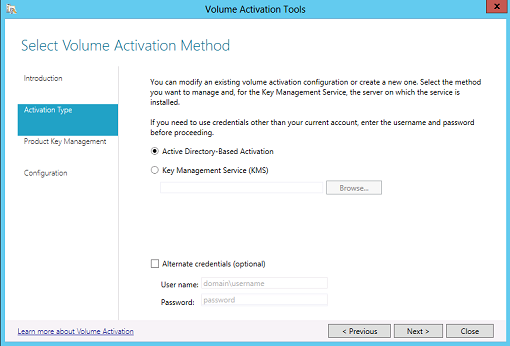

# Active Directory Domain Services-based activation of Office 2016

 **Summary:** Describes the basics of Active Directory Domain Services-based activation of Office 2016 clients. 
  
 **Audience:** IT Professionals 
  
Active Directory Domain Services (AD DS)-based activation enables an enterprise to activate Office 2016 clients on computers in the corporate network through a connection to the domain. When a user joins a computer to the domain, the AD DS-based activation object automatically activates Office 2016 installed on the computer, as long as the computer has a [Generic Volume License Key (GVLK)](../office2016/gvlks-for-office-2016.md). No single physical computer is required to act as the activation object, because it is distributed throughout the domain. For more information about AD DS-based activation, see [Active Directory-Based Activation Overview](https://go.microsoft.com/fwlink/p/?LinkID=249006).
  

## Supported operating systems for the client computers in an AD DS-based activation model

You can use the KMS activation method with the 32-bit and 64-bit editions of these operating systems.
  
For the computer from which you run setup and configuration:
  
- Windows 10
    
- Windows 8 or Windows 8.1
    
- Windows Server 2012 or Windows Server 2012 R2 
    
The domain controller must have Active Directory Domain Services with the Windows Server 2012 schema installed.
  

## Activate Office clients by using AD DS

AD DS-based activation uses the same client product key and host key that are used by KMS. By using AD DS-based activation, the Software Protection Platform Service (SPPSvc) periodically attempts to activate the product key against either an Activation Object (AO) in AD DS or a discoverable KMS host computer if the AD DS-based activation attempt fails. A successful AD DS-based activation grants a license to the Office 2016 client for 180 days.
  
You must be a member of the Administrators group on the Active Directory Domain Services domain controller to activate the KMS key in order to use it for AD DS-based activation of Office.
  
### Set up an AD DS-based activation host for Office 2016

1. Download the [Microsoft Office 2016 Volume License Pack](https://www.microsoft.com/download/details.aspx?id=49164) and run **office2016volumelicensepack_4285-1000_en-us_x86.exe**. 
    
    This launches the **Volume Activation Tools** wizard. 
    
2. On the first page, choose **Next**, and on the **Select Volume Activation Method** page, choose **Active Directory-Based Activation**.
    
     
  
3. On the **Manage Activation Objects** page, enter the KMS host key and, optionally, give it a name. 
    
4. Choose either the online or phone activation method and then follow the rest of the wizard instructions.
    
5. When you're done, an **Activation Succeeded** page displays. 
    
## Related topics
[Plan volume activation of Office 2016](plan-volume-activation-of-office.md)
  
[Prepare and set up the Office 2016 KMS host computer](configure-a-kms-host-computer-for-office.md)

