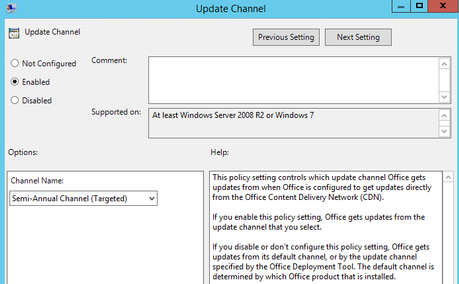
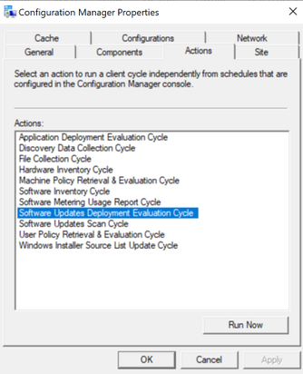

# How to manage Office 365 ProPlus Channels for IT Pros

Microsoft recommends enterprise customers include validation as a part of their Office 365 ProPlus deployment processes. Microsoft provides “channels” which control the rate of change in terms of features and quality fixes. For most customer deployments this means a minimum of two channels such as Semi-Annual Channel and Semi-Annual Channel (Targeted). Many IT Pros broadly deploy a single channel (usually Semi-Annual Channel) and leverage group policy to assign validation computers to faster channel such as Semi-Annual Channel (Targeted). In this way, IT Pros can preview what’s coming four months prior to production release.
 
The goal of the blog is to provide clarification around the mechanics on how Office 365 ProPlus processes channel change requests.
 
 *Tip: New Semi-Annual Channel versions are released in January\July and Semi-Annual Channel (Targeted) versions are released in March\September. All channels will receive a minimum of one build per month which contain security and critical customer escalated fixes. (The latter has very high bar)*

To read more about Channels please see [Overview of update channels for Office 365 ProPlus](https://docs.microsoft.com/en-us/deployoffice/overview-of-update-channels-for-office-365-proplus)
 
Ideally, minimizing the number of Office 365 ProPlus packages reduces overall cost of ownership. Therefore, the next step is to develop a process where machines receive standard package placing them on Semi-Annual Channel but dynamically move validation machines to faster channel such as Semi-Annual Channel (Targeted).

## Change the update channel with ODT

**Step 1: Before you begin, make sure the scheduled task "Office Automatic Update 2.0" is enabled** on the client devices. This task, which updates the assigned channel, is a required part of managing updates for Office 365 ProPlus, whether you use Group Policy, the Office Deployment Tool, or Configuration Manager.
 
**Step 2: Download the latest version of the ODT (setup.exe)** from the [Microsoft Download Center](https://go.microsoft.com/fwlink/p/?LinkID=626065).
 
**Step 3: Create a configuration file that specifies the new channel name.** In the example below, the channel changes to Monthly. For more information on channel names, see [Channel attribute in the Configuration Options article](https://docs.microsoft.com/en-us/deployoffice/configuration-options-for-the-office-2016-deployment-tool#channel-attribute-part-of-updates-element).

```
<Configuration>
	<Updates Channel="Targeted" />
</Configuration>
```

**Step 4: Deploy the configuration file using your standard processes.** After execution of Office Deployment Tool (ODT), the Office Automatic Update 2.0 task will automatically run based on trigger definition in scheduled task. After that task runs, it detects the updated policy and updates the assigned channel. After the task runs again, it detects the new assigned channel and Office updates to a new build from that channel. The Office user interface on the client device will not show the updated channel until a build of Office from the new channel is installed. 
 
## Change the update channel with Group Policy
**Step 1: Deploy your standard Office 365 ProPlus package based on Semi-Annual Channel**
 
**Step 2: Assign GPO to validation machine(s) or add policy registry key specifying Semi-Annual Channel (Targeted)**
 
Using [Office ADMX](https://www.microsoft.com/en-us/download/details.aspx?id=49030) files, use Update Channel GPO to set Semi-Annual Channel (Targeted)



Group Policy refreshes in the background every 90 minutes by default.  Use gpupdate /force to expedite.  Alternatively, add registry key manually to policy key

```
HKLM\SOFTWARE\Policies\Microsoft\office\16.0\common\officeupdate "updatebranch"="FirstReleaseDeferred"
```

**Step 3: Allow Microsoft\Office\Office Automatic Updates 2.0 scheduled task to run**
Group Policy will set registry keys, that’s all. Office 365 ProPlus uniquely leverages a scheduled task named Office Automatic Updates to maintain product configuration including channel management. The name itself “Automatic Updates” can cause confusion for IT Pros in enterprise environments where System Center Configuration (SCCM) is used to deploy updates. When OfficeMgmtCom (COM) is enabled, updates will be delivered only from SCCM. The Office Automatic Updates scheduled task will fire based on default set of triggers, regardless if COM is enabled or not, or by manually running task you can compress time frame to validate change.
 
 

*Microsoft recommends Automatic Updates remain Enabled (default configuration) in all update scenarios. This task does more than name implies. By disabling task, you may observe diminished experience in terms of channel management and disable feature to apply updates when SYSTEM is IDLE.*

See 2:00 in [Managing Office with SCCM (2019) video](https://www.youtube.com/watch?v=9lFyyj-V2AA) for more information, applicable for CDN update workflow.
 
 Tip: List of Channels and respective URL identifiers
CDNBaseUrl represents the channel where product was installed. If no channel was defined in unattend, Semi-Annual Channel is default selection.

```
Monthly Channel 
(formerly Current Channel):
CDNBaseUrl = http://officecdn.microsoft.com/pr/492350f6-3a01-4f97-b9c0-c7c6ddf67d60

Semi-Annual Channel 
(formerly Deferred Channel):
CDNBaseUrl = http://officecdn.microsoft.com/pr/7ffbc6bf-bc32-4f92-8982-f9dd17fd3114

Monthly Channel (Targeted)
(formerly First Release for Current Channel):
CDNBaseUrl = http://officecdn.microsoft.com/pr/64256afe-f5d9-4f86-8936-8840a6a4f5be

Semi-Annual Channel (Targeted) 
(formerly First Release for Deferred Channel):
CDNBaseUrl = http://officecdn.microsoft.com/pr/b8f9b850-328d-4355-9145-c59439a0c4cf
```

 Tip: IT Pros can monitor several registry keys to validate change has occurred after scheduled task has completed. Registry keys of interest when monitoring can be found under the following key: HKLM\SOFTWARE\Microsoft\Office\ClickToRun\Configuration. Editing key(s) should not be done directly and can lead to unintended consequences. Rather, monitor keys for desired outcome.
                                               
**UpdateChannel**: This is the channel configuration “winner”.  This is dynamically managed by the Automatic Updates scheduled task and should not be edited directly.
 
In our example where we are using GPO to move Office 365 ProPlus to Semi-Annual Channel (Targeted), Office Automatic Updates scheduled task will discover policy key and then will flip UpdateChannel to new value, in this case from http://officecdn.microsoft.com/pr/7ffbc6bf-bc32-4f92-8982-f9dd17fd3114 (SAC) to http://officecdn.microsoft.com/pr/b8f9b850-328d-4355-9145-c59439a0c4cf (SAC-T). Additionally, UpdateChannelChanged will be set to True. Upon next successful Office 365 Client update, UpdateChannelChanged will reset to False. The product can only accept one channel change request at a time with successful update as a prerequisite prior to accepting another change.
 
If you have completed steps above and channel change is still not being reflected, you may be blocked by temporary “Discovery Period.” Generally, updates will not happen within the Discovery Period which can last up to 24 hours after initial installation. IT Pros may encounter this scenario during compressed time validation in lab scenarios.
 
After UpdateChannel has successfully changed, Office 365 Clients pointing to CDN will download latest build from faster channel. Office 365 Clients which have COM enabled for SCCM integration will download newer build next time Software Updates Deployment Evaluation cycle runs based on configuration of Software Deployment within SCCM. IT Pros can expedite testing channel migration by deploying desired build to validation collection (should be a build from Semi-Annual Channel (Targeted), use the Configuration Manager applet from control panel to perform Machine Policy Retrieval followed by Software Updates Deployment Evaluation Cycle.



 Tip: Office 365 ProPlus behavior – slow to fast vs fast to slow

**Slower -> Faster (Example: Semi-Annual Channel to Semi-Annual Channel Targeted)**
- Client will always gracefully move forward when now available build number is higher.  For example, a client on June 2019 Semi-Annual Channel with build version 1808 (Build 10730.20348) will move to Semi-Annual Channel Targeted with build Version 1902 (Build 11328.20318).  No other Administrative intervention is required, normal update process\workflow applies the change.
**Faster -> Slower (Example: SAC-T to SAC)**
- In SCCM managed environment where COM is enabled, Office will not auto downgrade when channel is changed.  It will only move forward once build advertised is greater than what’s currently installed.  For example, Office ProPlus client on Semi-Annual Targeted build June 2019 Version 1902 (Build 11328.20318) will have to wait until Semi-Annual Channel build number is greater to move forward such as July 2019 Version 1902 (Build 11328.20368).  Supported downgrade method is to re-run Office Deployment Tool (ODT) with desired build and channel.  Keep in mind during waiting period, Office 365 Client will not receive any updates including security.
- In non COM managed environment such as default configuration CDN, we will downgrade your new version to match the Group Policy assigned.  

*Since we can’t do binary delta compression (BDC) the download will be larger.  As a result, network considerations should be considered when downgrading from CDN.
 
FAQ:

**How does channel management work when Office 2019 is installed and GPO "Upgrade Office 2019 to Office 365 ProPlus" is enabled?**

Some customers may have a need to have one factory image of Windows which includes Office 2019 and later upgrade a subset of machines to Office 365 ProPlus.  The steps outlined above still apply in terms of mechanics and how channel chnages are processed.  The only difference is Office 2019 will initially have CDNBaseURL and UpdateChannel will reflect http://officecdn.microsoft.com/pr/f2e724c1-748f-4b47-8fb8-8e0d210e9208.  First, the GPO above will set policy key.  Second, The Office Automatic Updates 2.0 scheduled task will flip the UpdateChannel to Semi-Annual Channel (3114) by default and dynamically convert the product to Semi-Annual Channel.  In short, Office 2019 is just an older version of Office 365 ProPlus, so differences in content between the two products will download from CDN or from SCCM Distribution Point depending on your configuration. (Size will be significant for one-time conversion).  For CDN, this process is automatic.  For SCCM, IT Pro only needs to deploy latest Semi-Annual Channel build software update to collection, just like any monthly "Patch Tuesday" process.  SCCM will find build applicable and upgrade like any other Office update.  Licensing\Activation will switch from volume activation (KMS) to subscription based (Office Licensing Service).
 
**Why does this guidance differ from SCCM page Change the update channel after you enable Office 365 clients to receive updates from Configuration ...?**

Microsoft recommends customers leverage Group Policy to change Office 365 ProPlus channels because its easier for IT Pros. Group Policy sets registry key under policy hive and Office Automatic Updates scheduled task to processes channel change.  The link above references CDNBaseURL.  Notice from the list below this is the 4th item evaluated for priority by the scheduled task.  As a result, if the first three priorities listed are not configured and CDNBaseURL doesn't match UpdateChannel, scheduled task will align them resulting in channel change.  This blog posting leads with Group Policy where link above requires a direct registry change through Group Policy Preferences or Compliance Item in SCCM.
 
```
1st Priority : GPO "UpdatePath" - HKLM\software\policies\microsoft\office\16.0\common\officeupdate!updatepath
2nd Priority : GPO "UpdateChannel" - HKLM\software\policies\microsoft\office\16.0\common\officeupdate!updatebranch
3rd Priority : "UpdateURL" or UpdatePath="\\Server\Share" HKLM\SOFTWARE\Microsoft\Office\ClickToRun\Configuration
4th Priority : CDNBaseURL - HKLM\SOFTWARE\Microsoft\Office\ClickToRun\Configuration\CDNBaseUrl
```

I hope this blog post helps provide additional context for how Office ProPlus Channel Management works "under the hood".
 