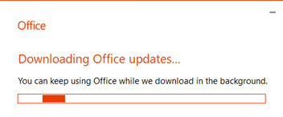
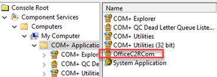
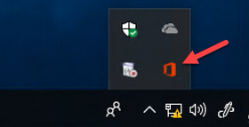
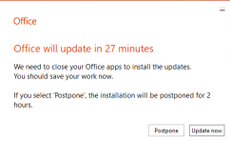
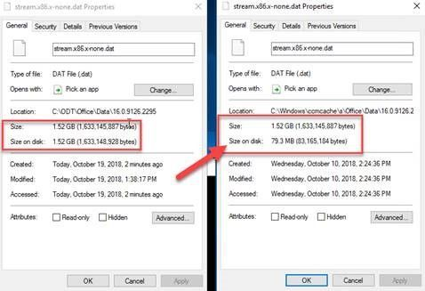

# Understand Office 365 ProPlus Updates for IT pros (CDN vs SCCM)

When we support customers in the field, we receive many questions about the Office 365 ProPlus update process. This article provides context about end-user behavior during update scenarios and clarifies when and how Office updates are applied.

Office ProPlus was designed to be a *cloud-first* product. By default, we recommend that you update Office 365 ProPlus directly from the Microsoft Content Delivery Network (CDN). Office 365 ProPlus is automatically kept up to date through an "evergreen" model. IT pros can offload the servicing aspect of Office 365 ProPlus to Microsoft so that they can avoid repetitive tasks and focus on other duties. ALthough we recommend using CDN, most of our Enterprise customers manage updates from System Center Configuration Manager (SCCM) for a variety of reasons.

Let's compare both options to see which approach best addresses your business requirements. Either way, the goal is to ensure that Office 365 ProPlus is serviced every month to address security and deliver features at a cadence that suits our customers.
 
## Quick refresher of Office ProPlus channel cadence simplified

**Monthly:** Provides users the newest features of Office as soon as they're available. The frequency  could be three or four builds per month. (Updates should be delivered by the CDN.)

**Semi-Annual Channel (Targeted):** Provides pilot users and application compatibility testers the opportunity to test the next Semi-Annual Channel update.  Features/fixes are delivered every six months, in March and September. (Updates can use the CDN or SCCM.)

**Semi-Annual Channel:** Provides users new features only a few times a year. Features/fixes are delivered every six months, in January and July. (Updates can use the CDN or SCCM.)

Official link: [Overview of update channels](https://docs.microsoft.com/deployoffice/overview-of-update-channels-for-office-365-proplus).
 
> [!NOTE]
> The point of the channels is to define the timing of when cumulative builds include features and fixes in addition to security. For more information about channel management, see [How to manage Office 365 ProPlus Channels for IT Pros](how-to-manage-office-365-proplus-channels-for-it-pros.md)

## Update from the CDN

### Prerequisites

Automatic Updates is by enabled by default. (The equivalent GPO is "Enabled Automatic Updates"). If this option is disabled, Office 365 ProPlus will *never update*.

### Benefits

- Admins don't have to spend time developing processes to duplicate CDN content on-premises.
- Admins don't have to build processes to target software updates to collections. Each machine will pull updates on its own.
- Aligns with "Modern Desktop" motion, where machines are increasingly managed by mobile device management rather than on-premises solutions without requiring  any infrastructure.
- The CDN supports a variety of advanced policies to control updates at a granular level. These include "delay downloading and installing updates for Office," "prioritize BITS," "target version," "update channel," and "update deadline." IT pros can control updates effectively without any need for on-premises software.
- Uses inbox task scheduler \Microsoft\Office\Office Automatic Updates 2.0 to perform updates based on a trigger mechanism (weekly, at log-on, on idle).

> [!NOTE]
> [On idle](https://docs.microsoft.com/windows/win32/taskschd/task-idle-conditions) is a trigger condition that can check for criteria such as user absence and lack of resource consumption to determine an opportune time to retry updates. (No reboots are required when Office applications are closed.)

Reference links for the next section: 
- [Update history for Office 365 ProPlus (listed by date)](https://docs.microsoft.com/officeupdates/update-history-office365-proplus-by-date)
- [Download sizes for updates to Office 365 ProPlus](https://docs.microsoft.com/officeupdates/download-sizes-office365-proplus-updates)

### User experience when updating from the CDN

Let's imagine Office 365 ProPlus has the June 2019 build installed, which is version 1808 (build 10730.20348). "Patch Tuesday" arrives, and on July 9, the 2019 July build is released, which is version 1902 (build 11328.20368). Based on the trigger that's assigned, the "Office Automatic Updates 2.0" scheduled task will detect an applicable newer build. 

At initial release to the CDN, a new build is temporary throttled until the quality of the release is verified. So, updates may not occur on day 0 to all machines but instead happen over a period of days. But IT pros can intervene and enable the policy "delay downloading and installing updates for Office" and define installing updates based on the number of days. This method mirrors the servicing plans feature in SCCM for delivering Windows Feature Updates and makes it easy to build rings.

Since the build that's installed is the most recent version, we can leverage a feature called *binary delta compression* to help reduce the size of the files. This feature makes it easier to keep Office ProPlus up to date on your network. Office will download deltas and will stage in *C:\Program Files\Microsoft Office\Updates\Download*. After download, Office Automatic Updates 2.0 will try to update Office 365 ProPlus. If no Office applications are open, the updates will occur. If any Office apps are open at the time of the update request, a series of notifications is presented over a period of days. (For details, see [End-user update notifications for Office 365 ProPlus](https://docs.microsoft.com/deployoffice/end-user-update-notifications-for-office-365-proplus).)

If the updates still aren't applied after four days, a message appears in the Windows notification area telling the user that updates are available.


If the updates still aren't applied after six days, a message appears in any newly opened Office document to remind the user that updates are available. We call this the "BusBar." It lets users drive change when it's convenient.


If you click **Update now** on the bar when Office applications are open, you'll see a dialog box like the following example. Click **Continue** to save your work, update, and reopen your Office applications.


The Office Backstage also offers an **Update now** option that lets the user check for updates to install. This option brings up the same dialog box.




IT pros can also configure an "update deadline" policy for when Office updates must be applied.  Users receive notifications leading up to the deadline. For example, within 72 hours of the deadline, they see a message in any newly opened Office document that updates are blocked because of open apps.


Additional sequential reminders will notify the user that update is mandatory. A message appears every 2 hours. It's also shown 60 minutes, 30 minutes, 15 minutes, and 5 minutes before the deadline.


If the deadline arrives and the update hasn't been applied, a message warns the user that the update will happen in 15 minutes.


## Update from SCCM
 
### Prerequisites

- SCCM Current Branch with Windows Server Update Services (WSUS) 4.0. But you can't use WSUS by itself to deploy these updates. You need to use WSUS in conjunction with Configuration Manager.
- The hierarchy's top-level WSUS server and the top-level Configuration Manager site server must have access to the following URLs:
    -  *.microsoft.com
    -  *.msocdn.com
    - *.office.com
    - *.office.net
    - *.onmicrosoft.com
    - officecdn.microsoft.com
    - officecdn.microsoft.com.edgesuite.net

- The Office 365 client product must be selected on the **Products** tab under **Software Update Point Component Properties and synchronize software updates after change**. Then you should see Office 365 client updates populate the Office 365 Updates node under **Office 365 Client Management** on the **Software Library** tab in the SCCM console.
- **Office 365 Client Management** must be enabled on the client. This setting can be configured in multiple ways, such as by adding *OfficeMgmtCOM="TRUE"* to *configuration.xml* during installation, enabling the "Office 365 Client Management" domain policy, or toggling **Enable management of the Office 365 Client Agent** to *yes* in the SCCM client settings under **Software Updates**. To verify, launch *dcomcnfg.exe* on the client computer and confirm that the OfficeC2RCom application is registered.  **Only one is required**, where policy overrides and take priority over all other methods. The purpose of the COM application is to allow Office 365 ProPlus to cooperate with SCCM to pull updates from distribution points rather than from the CDN.



*Example of running dcomcnfg.exe*

>[!NOTE]
> Most enterprise customers use SCCM to deliver Office 365 Client updates for compliance and distribute content from distribution points. Microsoft is working to provide additional options, including the new feature [Delivery Optimization and Office 365 ProPlus](https://docs.microsoft.com/deployoffice/delivery-optimization), which is now available in preview. Read the article for full details, but basically customers will be able to install *and* update Office 365 ProPlus sourcing content from peers without infrastructure requirements (no more "thick packages" or distributing loads of content to support a simple language pack).
>
> If you enabled OfficeMgmtCom for SCCM integration, this action must be reversed to use Delivery Optimization (DO). The Microsoft Office Click-to-Run service is responsible for registering and unregistering the OfficeC2RCom (OfficeMgmtCOM) application during service startup. Changing domain policy or SCCM client settings for Office 365 Client Management from **Enabled** to **Not configured** *is not enough*. Domain Policy or SCCM client settings require that you explicitly **Disable** this selection to successfully deregister OfficeC2RCom and restore the default configuration. Any custom update path configuration must also be removed.

### Benefits

- Office 365 ProPlus updates can easily be included in your monthly Windows patch deployment process. As a result, all existing business processes and change control can be aligned in the same way as legacy MSI Office products.
- Clients only pull down what's needed to update themselves from a distribution point.
- SCCM administrators can download a cumulative build once from the Internet and then deploy to all distribution points. Clients can then pull updates from intranet sources.
- Administrators can make deployment available as an option where users are notified of updates.
- Administrators can make deployments available for a period of time prior to an installation deadline. In this scenario, an Office 365 client that's using OfficeMgmtCOM will pull deltas from a distribution point prior to the deadline and give users a chance to "update now" via the BizBar, as discussed earlier, at a convenient time. This option is especially important in a world where many machines are mobile and not turned on all the time. IT pros can also get some early production validation, as a subset of their user population will update prior to the installation deadline, providing advance notice of any problems prior to broad deployment.
- Administrators can make the *deployment-available* time and the *installation deadline* the same. SCCM will then make sure the update is downloaded and installed at that time. (See the next section for details on the user experience.)
- Administrators can enable SCCM features such as peer cache so clients can share content among themselves, which can help reduce WAN traffic. See [Peer cache for Configuration Manager clients](https://docs.microsoft.com/sccm/core/plan-design/hierarchy/client-peer-cache).

## User experience when updating from SCCM

> [!NOTE]
> Frequency of toast notifications from SCCM is configurable in **Client Settings** under **Computer Agent**. This configuration is applicable to all software deployments, not just the Office 365 client.


*Can be found within SCCM console under client settings*


## SCCM deployment scenarios
 
### Scenario 1 - Available only

If the deployment is *available only*, the user will only see a toast notification in the system tray for a few seconds. Office update will never be deployed automatically. The problem is that this notification isn't context-sensitive, so it simply takes the user to Software Center. It also doesn't ensure security compliance. Therefore, this approach isn't used often.
 
### Scenario 2 - Available with future installation deadline

This scenario is a good fit for customers who want faster compliance and no reboots for Office 365 ProPlus updates and who are comfortable with additional Office 365 ProPlus end-user toast notifications in app notifications as well as an Office 365 ProPlus countdown dialog box message leading up to deadline. If the SCCM deployment is *available with future installation deadline*, Office 365 ProPlus working with the OfficeC2RCom application will download the necessary Office build pieces (not the entire build) and stage for installation pulling content from distribution points. When COM is enabled and a new build is staged, restart of Windows will not  install the updates. Immediately after the newer build is staged, any Office 365 ProPlus application that's reopened will immediately show the "BusBar" with the **Update now** button. There's a subtle difference compared to the CDN scenario, where the banner appears only after a number of days. Clicking the button results in the same workflow as defined in the CDN section. When content is prestaged, there are a number of potential notifications. See bullet items in blue at [Manage Office 365 ProPlus with Configuration Manager](https://docs.microsoft.com/sccm/sum/deploy-use/manage-office-365-proplus-updates#restart-behavior-and-client-notifications-for-office-365-updates).

For example:


Once a build is staged, a toast notification might not appear until the user clicks the icon in the notification area. This is easy to miss.



*"Basic notification," which is sometimes hidden under the task bar chevron*


7.5 hours before the deadline, Office will show the *Enforced toast*, which will present the "Office Updates Available" toast as described previously in the foreground. If the user doesn't select **Update now**, they will potentially receive three additional notifications with a countdown. If no decision is made to postpone, Office applications will eventually be forced closed and updates installed at the deadline as defined in SCCM.

|       |  |  |
| :------------- | :----------: | -----------: |
| *Minute countdown* | *Second countdown* | *Updates installed* |


If the user selects **Postpone** and the deadline is eventually reached, a standard SCCM restart window will be displayed with a countdown. Office may also raise additional notification with a 30-minute countdown. It's important to note that countdowns from SCCM and Office are not synchronized in any way. They have separate timers.


### Scenario 3 - Available and required installation deadline are the same

This scenario is best for IT pros who want to minimize notifications to users unless the deadline has been reached. (The Office content is not prestaged.) If the software deployment *available time* and *installation deadline* are the same, the SCCM client will determine that the deadline was missed and therefore make the deployment immediate. A typical notification workflow will be presented to the user.  


In this case, since the deadline has passed, download will begin automatically.


After the content has been downloaded, SCCM will immediately initiate the Office update by using the following logic:  
- If all Office applications are closed, updates will occur with no reboot. 
- If any Office apps are open, the standard SCCM reboot workflow occurs.


The user will see an SCCM restart message window with a countdown until a restart is forced. The frequency of notifications is controlled solely by the SCCM client. It can be configured in the **Client Settings** node in the SCCM console.


## Frequently asked questions

**Is there a simple way to hide all notifications in Office, such as the “BizBar” with the "Update Now" button?**

Yes. Use the "Hide Update Notifications" GPO or the registry.

```
HKLM\SOFTWARE\Policies\Microsoft\office\16.0\common\officeupdate
"hideupdatenotifications"=dword:00000001
```
> [!WARNING]
> This registry setting doesn't apply to deadline notifications, such as the large white splash screen with countdown.
 
**Is there an official Microsoft webpage that covers this topic?**

Yes: [Manage Office 365 ProPlus with Configuration Manager](https://docs.microsoft.com/sccm/sum/deploy-use/manage-office-365-proplus-updates).

**If the download is supposed to only contain deltas and stage to *C:\Program Files\Microsoft Office\Updates\Download*, why in my environment is it staged in *C:\Windows\ccmcache and full build (~2 GB)***?

This means that the SCCM "Peer cache" feature is enabled, and content is available to be shared with other peers. Windows is using an NTFS feature called "[Sparse files](https://docs.microsoft.com/windows/win32/fileio/sparse-files)." By looking closely at the size in disk details, you can compare the differences as shown below between the full data and the one on the right using peer cache. (Peer cache really only downloaded 80 MB here.)



**I’ve done everything I can think of, and the OfficeC2RCom application never shows in the MMC console. In fact, when I browse COM applications from within dcomconfg.exe, my Computer has a red down arrow. Why?**

COM, which is part of .NET, may be corrupted on the machine. Office can't register the application, as COM itself is broken. Unfortunately, this scenario typically requires a rebuild of Windows.

**You mentioned the [On idle](https://docs.microsoft.com/windows/win32/taskschd/task-idle-conditions) update feature in the CDN section but it was omitted for SCCM. Why?**

By design, this feature is enabled only for the CDN scenario.

**Users who launch Office immediately after logon receive the message "Updating Office, please wait a moment." Why?**


This means an Office update was attempted while applications were open, which can't succeed.  Therefore, build was staged to retry the update by the Microsoft Office Click-to-Run service at Windows startup. In this case, the user was able to access the desktop and start an Office application while the Office update process was in progress. If easily reproducible, this is often a reflection of slow boot process and Windows startup performance. It's best to troubleshoot by removing third-party filter drivers and unnecessary startup items.

**I've tried everything, and Software Center never shows the Office 365 client build applicable to my machine. Why?**

Review how Office 365 ProPlus determines priority:

```
1st priority : GPO "UpdatePath" - HKLM\software\policies\microsoft\office\16.0\common\officeupdate!updatepath
2nd priority : GPO "UpdateChannel" - HKLM\software\policies\microsoft\office\16.0\common\officeupdate!updatebranch
3rd priority : "UpdateURL" or UpdatePath="\\Server\Share" under HKLM\SOFTWARE\Microsoft\Office\ClickToRun\Configuration
4th Priority : "CDNBaseURL" - HKLM\SOFTWARE\Microsoft\Office\ClickToRun\Configuration\CDNBaseUrl
```
Based on this priority list, have you intentionally or unintentionally set a GPO "UpdatePath" - *HKLM\software\policies\microsoft\office\16.0\common\officeupdate!updatepath* or included an element in *configuration.xml* during initial installation for *UpdatePath HKLM\SOFTWARE\Microsoft\Office\ClickToRun\Configuration\UpdatePath="\\Server\Share"*? This in effect breaks native updates via SCCM, as they take precedence. To resolve this problem:
1. Remove these values and reset *HKLM\SOFTWARE\Microsoft\Office\ClickToRun\Configuration UpdateChannelChanged* to *False*.
2. Run the *Automatic Updates 2.0* scheduled task manually, or be patient and allow it to run.
3. Perform the Software Updates Deployment Evaluation Cycle from the SCCM control panel item.
 
**You didn't mention updating from on-premises file share. Why?**

Updating Office 365 ProPlus from file shares has been de-emphasized as a strategy. Initially, Office 365 ProPlus didn't support update workflows such as SCCM or delivery optimization, and therefore customers used this approach.  However, that issue is resolved with SCCM Current Branch and recent versions of Windows 10, so this method is no longer necessary. (It's still supported, just little used.)
